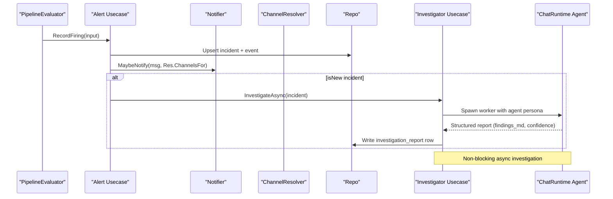
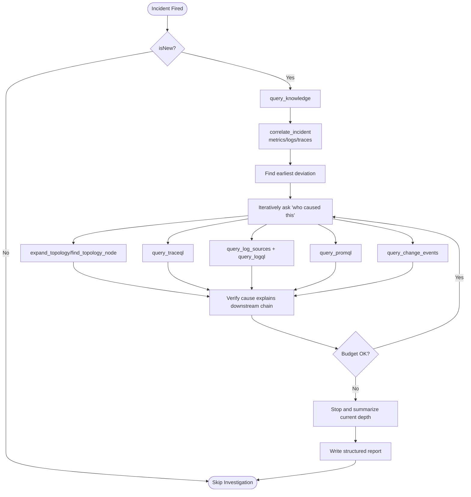
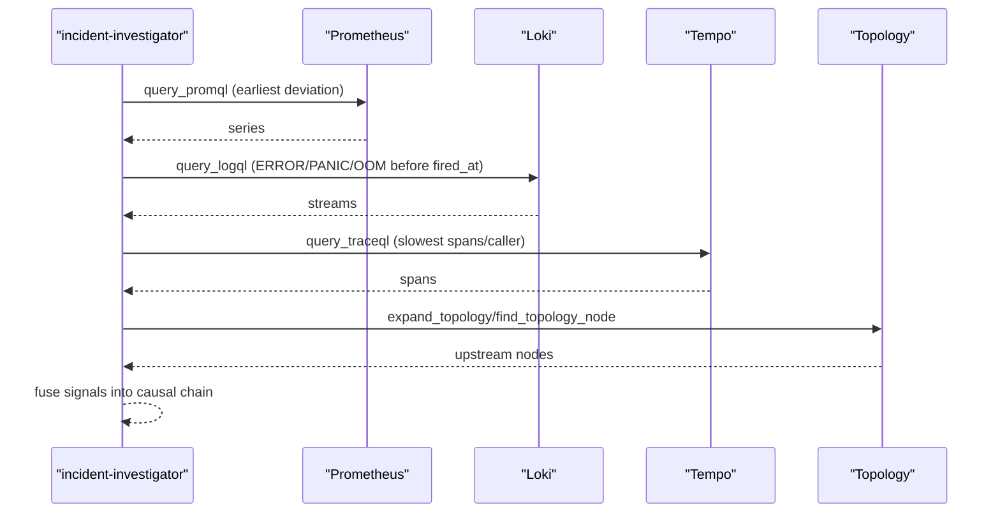
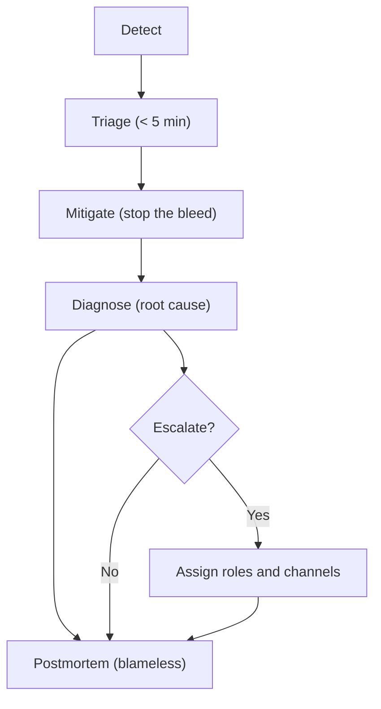
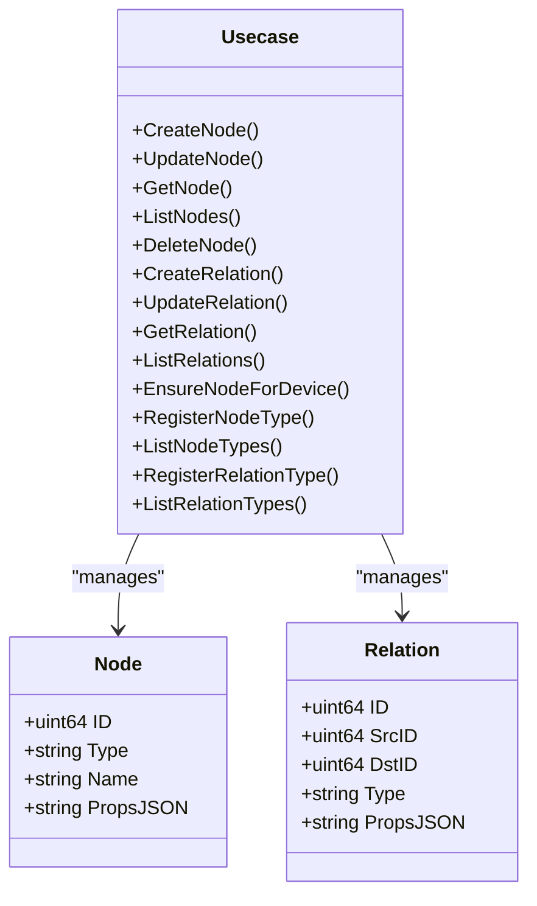
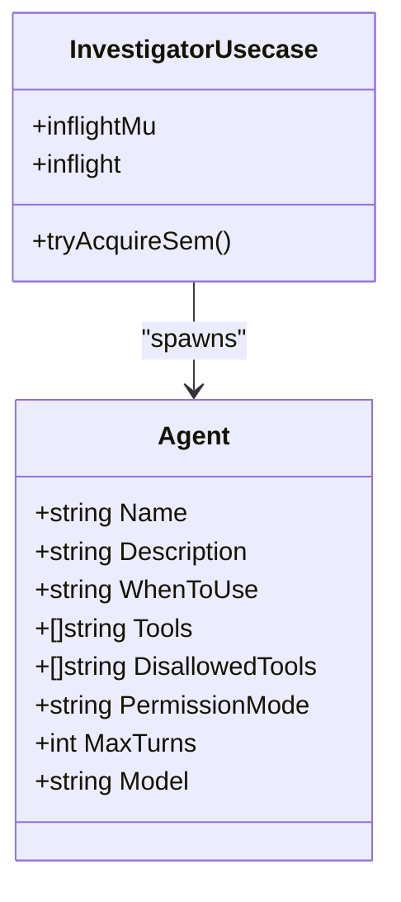
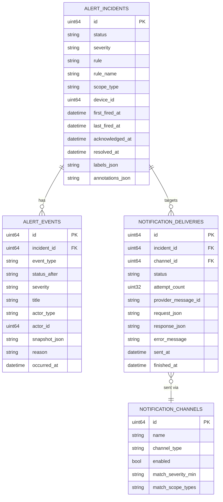
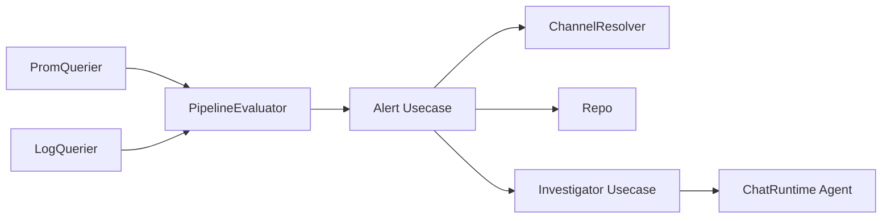

# Incident Response Workflows

<cite>
**Referenced Files in This Document**
- [incident-investigator.md](file://agents/incident-investigator.md)
- [incident-response.md](file://internal/manager/biz/knowledge/builtin_vault/concepts/incident-response.md)
- [pipeline.go](file://internal/manager/biz/alert/pipeline.go)
- [router.go](file://internal/manager/biz/alert/router.go)
- [usecase.go](file://internal/manager/biz/alert/usecase.go)
- [repo.go](file://internal/manager/biz/alert/repo.go)
- [model.go](file://internal/manager/model/alert/model.go)
- [usecase.go](file://internal/manager/biz/alert/investigator/usecase.go)
- [types.go](file://internal/manager/biz/aiops/chatruntime/types.go)
- [IncidentDetail.tsx](file://web/src/pages/IncidentDetail.tsx)
- [rca_pipeline_test.go](file://tests/e2e/rca_pipeline_test.go)
- [ROADMAP.md](file://ROADMAP.md)
</cite>

## Table of Contents
1. [Introduction](#introduction)
2. [Project Structure](#project-structure)
3. [Core Components](#core-components)
4. [Architecture Overview](#architecture-overview)
5. [Detailed Component Analysis](#detailed-component-analysis)
6. [Dependency Analysis](#dependency-analysis)
7. [Performance Considerations](#performance-considerations)
8. [Troubleshooting Guide](#troubleshooting-guide)
9. [Conclusion](#conclusion)
10. [Appendices](#appendices)

## Introduction
This document explains the end-to-end incident response workflows in Ongrid, focusing on automated investigation, alert correlation, and remediation. It maps the lifecycle from detection through resolution, detailing investigation phases, decision points, and the integration between the alerting system and AI investigation agents. It also documents the graph-based reasoning system for correlation and root cause analysis, multi-agent coordination patterns, escalation policies, human-in-the-loop workflows, audit trails, and integrations with external ticketing systems and remediation tools.

## Project Structure
The incident response domain spans several layers:
- Alerting pipeline: evaluation, deduplication, notification routing, and incident lifecycle
- Investigation subsystem: proactive AI agent orchestration and structured reporting
- Knowledge and SOP: documented procedures and roles
- UI: incident workspace and investigation report rendering
- Tests: end-to-end validation of the RCA pipeline

```mermaid
graph TB
subgraph "Alerting"
P["PipelineEvaluator<br/>evaluatePromQuery / Phase-B evaluators"]
U["Usecase<br/>RecordFiring / MaybeNotify"]
R["Repo<br/>persistence"]
CH["ChannelResolver<br/>routing"]
end
subgraph "Investigation"
INV["Investigator Usecase<br/>async spawn"]
CR["ChatRuntime Agent<br/>incident-investigator"]
end
subgraph "Knowledge"
SOP["SOP Concepts<br/>incident-response.md"]
end
subgraph "UI"
UI["IncidentDetail Page<br/>render report"]
end
P --> U --> CH --> R
U --> INV
INV --> CR
SOP -. guides .-> CR
CR --> UI
```

**Diagram sources**
- [pipeline.go:261-380](file://internal/manager/biz/alert/pipeline.go#L261-L380)
- [usecase.go:297-438](file://internal/manager/biz/alert/usecase.go#L297-L438)
- [router.go:78-133](file://internal/manager/biz/alert/router.go#L78-L133)
- [usecase.go:1-36](file://internal/manager/biz/alert/investigator/usecase.go#L1-L36)
- [types.go:252-282](file://internal/manager/biz/aiops/chatruntime/types.go#L252-L282)
- [incident-response.md:6-66](file://internal/manager/biz/knowledge/builtin_vault/concepts/incident-response.md#L6-L66)
- [IncidentDetail.tsx:490-626](file://web/src/pages/IncidentDetail.tsx#L490-L626)

**Section sources**
- [pipeline.go:1-505](file://internal/manager/biz/alert/pipeline.go#L1-L505)
- [usecase.go:1-800](file://internal/manager/biz/alert/usecase.go#L1-L800)
- [router.go:1-259](file://internal/manager/biz/alert/router.go#L1-L259)
- [incident-response.md:1-84](file://internal/manager/biz/knowledge/builtin_vault/concepts/incident-response.md#L1-L84)
- [IncidentDetail.tsx:490-626](file://web/src/pages/IncidentDetail.tsx#L490-L626)

## Core Components
- Alert pipeline: evaluates rules, deduplicates incidents, and triggers notifications
- Alert usecase: manages incident creation, transitions, and proactive investigation
- Channel resolver: selects notification channels based on severity, scope, and rule/channel bindings
- Investigator usecase: orchestrates AI investigation on new incidents
- AI agent: incident-investigator with structured prompts and tool constraints
- UI: renders investigation report and status states
- Models: persistent entities for incidents, events, rules, channels, and deliveries

**Section sources**
- [pipeline.go:261-380](file://internal/manager/biz/alert/pipeline.go#L261-L380)
- [usecase.go:297-438](file://internal/manager/biz/alert/usecase.go#L297-L438)
- [router.go:78-133](file://internal/manager/biz/alert/router.go#L78-L133)
- [usecase.go:1-36](file://internal/manager/biz/alert/investigator/usecase.go#L1-L36)
- [types.go:252-282](file://internal/manager/biz/aiops/chatruntime/types.go#L252-L282)
- [model.go:209-377](file://internal/manager/model/alert/model.go#L209-L377)

## Architecture Overview
The system integrates alert generation with AI-driven root cause analysis and structured reporting. The alert pipeline detects anomalies, creates or updates incidents, and routes notifications. On the first occurrence of an incident, the system optionally spawns an AI investigation worker to correlate signals and propose a root cause. The UI presents the investigation report and status.



**Diagram sources**
- [pipeline.go:382-416](file://internal/manager/biz/alert/pipeline.go#L382-L416)
- [usecase.go:421-429](file://internal/manager/biz/alert/usecase.go#L421-L429)
- [router.go:78-133](file://internal/manager/biz/alert/router.go#L78-L133)
- [usecase.go:348-378](file://internal/manager/biz/alert/investigator/usecase.go#L348-L378)
- [types.go:252-282](file://internal/manager/biz/aiops/chatruntime/types.go#L252-L282)

## Detailed Component Analysis

### Automated Incident Investigation Workflow
- Trigger: On the first occurrence of an incident (isNew), the alert usecase asynchronously invokes the investigator.
- Agent persona: The incident-investigator agent follows a causal traversal loop, starting with knowledge base retrieval, then correlating metrics, logs, traces, and topology to identify the earliest deviation and upstream causes.
- Tool constraints: The agent is permission-mode read-only and capped at a fixed number of tool calls to avoid infinite loops.
- Structured output: The agent’s final synthesis is captured as a structured report with root cause, causal chain, phenomenon, and confidence.



**Diagram sources**
- [usecase.go:421-429](file://internal/manager/biz/alert/usecase.go#L421-L429)
- [incident-investigator.md:59-117](file://agents/incident-investigator.md#L59-L117)

**Section sources**
- [usecase.go:421-429](file://internal/manager/biz/alert/usecase.go#L421-L429)
- [incident-investigator.md:1-117](file://agents/incident-investigator.md#L1-L117)
- [types.go:252-282](file://internal/manager/biz/aiops/chatruntime/types.go#L252-L282)

### Alert Correlation and Signal Fusion
- Correlation: The correlate_incident skill pulls metrics, traces, and logs around the incident time window to establish a timeline and identify the earliest divergence.
- Multi-source signals: The agent queries Prometheus for metrics, Loki for logs, and Tempo/Tempo-compatible stores for traces.
- Topology-awareness: The agent expands upstream topology edges to discover upstream causes and system dependencies.
- Evidence grounding: Each causal step references concrete evidence (PromQL expressions, log lines, trace spans).



**Diagram sources**
- [incident-investigator.md:68-78](file://agents/incident-investigator.md#L68-L78)

**Section sources**
- [incident-investigator.md:68-78](file://agents/incident-investigator.md#L68-L78)

### Remediation Workflows and Human-in-the-Loop
- Mitigation-first: The SOP emphasizes stopping the bleed before diagnosing root cause. Mitigations (rollbacks, traffic shifts, rate limits) are captured in the timeline.
- Human-in-the-loop: The agent remains read-only; suggested actions are proposed for operator review and approval. The UI surfaces “Run root-cause analysis now” for manual invocation.
- Escalation: The SOP defines severity-based response targets and roles (IC, Investigator, Communicator, Scribe). The alerting system supports per-rule and per-system channel bindings to route notifications appropriately.



**Diagram sources**
- [incident-response.md:11-66](file://internal/manager/biz/knowledge/builtin_vault/concepts/incident-response.md#L11-L66)

**Section sources**
- [incident-response.md:11-66](file://internal/manager/biz/knowledge/builtin_vault/concepts/incident-response.md#L11-L66)
- [IncidentDetail.tsx:502-599](file://web/src/pages/IncidentDetail.tsx#L502-L599)

### Graph-Based Reasoning for Correlation and Root Cause
- Topology integration: The agent uses topology expansion to move upstream and identify upstream causes. The topology usecase manages node and relation lifecycles.
- Directionality and semantics: The roadmap outlines adding directed edges and per-metric baselines to improve causal inference.
- Visualization: The roadmap proposes rendering the causal chain as a node-edge graph in the UI.



**Diagram sources**
- [usecase.go:1-420](file://internal/manager/biz/topology/usecase.go#L1-L420)

**Section sources**
- [usecase.go:1-420](file://internal/manager/biz/topology/usecase.go#L1-L420)
- [ROADMAP.md:41-54](file://ROADMAP.md#L41-L54)

### Multi-Agent Coordination Patterns
- Coordinator pattern: Agents are spawned by a coordinator based on when_to_use hints. The agent schema defines tool whitelists, disallowed tools, permission modes, and max turns.
- Parallelism: Investigator usecase coalesces concurrent requests for the same incident and caps global concurrency to protect LLM provider rate limits and memory.
- Safety: Reviewer agent ensures gates are met before approving actions; otherwise it rejects.



**Diagram sources**
- [types.go:252-282](file://internal/manager/biz/aiops/chatruntime/types.go#L252-L282)
- [usecase.go:348-378](file://internal/manager/biz/alert/investigator/usecase.go#L348-L378)

**Section sources**
- [types.go:252-282](file://internal/manager/biz/aiops/chatruntime/types.go#L252-L282)
- [usecase.go:348-378](file://internal/manager/biz/alert/investigator/usecase.go#L348-L378)

### Audit Trail and Timeline
- Events: Every firing, acknowledgment, resolution, notification attempts, and AI-generated notes are persisted as events with snapshots and reasons.
- Timeline: The UI renders the incident timeline and investigation report, including confidence and suggested actions.
- Retries: Delivery attempts are tracked with statuses and error messages.



**Diagram sources**
- [model.go:209-377](file://internal/manager/model/alert/model.go#L209-L377)

**Section sources**
- [model.go:209-377](file://internal/manager/model/alert/model.go#L209-L377)
- [IncidentDetail.tsx:599-626](file://web/src/pages/IncidentDetail.tsx#L599-L626)

### Integration with External Systems
- Ticketing: The system does not define a built-in ticketing integration; however, the UI indicates that auto-root-cause analysis can be enabled via a feature flag and restarted in the manager. Integrations with external systems can be added via notification channels and custom tools.
- Remediation tools: The agent is read-only by design; remediation actions are surfaced as suggestions for human approval and execution outside the agent.

**Section sources**
- [IncidentDetail.tsx:502-509](file://web/src/pages/IncidentDetail.tsx#L502-L509)

## Dependency Analysis
The alerting pipeline depends on Prometheus, Loki, and Tempo clients to evaluate rules and correlate signals. The alert usecase coordinates with the investigator usecase and channel resolver. The investigator usecase depends on the chatruntime agent configuration and spawns workers asynchronously.



**Diagram sources**
- [pipeline.go:35-73](file://internal/manager/biz/alert/pipeline.go#L35-L73)
- [usecase.go:20-30](file://internal/manager/biz/alert/usecase.go#L20-L30)
- [router.go:11-16](file://internal/manager/biz/alert/router.go#L11-L16)
- [usecase.go:1-36](file://internal/manager/biz/alert/investigator/usecase.go#L1-L36)
- [types.go:252-282](file://internal/manager/biz/aiops/chatruntime/types.go#L252-L282)

**Section sources**
- [pipeline.go:35-73](file://internal/manager/biz/alert/pipeline.go#L35-L73)
- [usecase.go:20-30](file://internal/manager/biz/alert/usecase.go#L20-L30)
- [router.go:11-16](file://internal/manager/biz/alert/router.go#L11-L16)
- [usecase.go:1-36](file://internal/manager/biz/alert/investigator/usecase.go#L1-L36)
- [types.go:252-282](file://internal/manager/biz/aiops/chatruntime/types.go#L252-L282)

## Performance Considerations
- Concurrency control: Investigator usecase enforces a global cap on live workers to protect LLM provider rate limits and memory.
- Deduplication: The pipeline uses dedupe keys to avoid redundant investigations and notifications.
- Budget discipline: The agent’s tool budget prevents deep recursion and empty branches.

**Section sources**
- [usecase.go:367-378](file://internal/manager/biz/alert/investigator/usecase.go#L367-L378)
- [incident-investigator.md:81-89](file://agents/incident-investigator.md#L81-L89)

## Troubleshooting Guide
- Investigation not starting: Check the feature flag enabling auto RCA and confirm the manager is restarted. The UI displays a notice when the feature is disabled.
- Investigator stuck in pending: Investigate UI status states and retry the manual run button.
- Investigation failed: Inspect the status reason and LLM availability; the usecase writes a failed report row without blocking the alert pipeline.
- Notification issues: Review delivery rows for error messages and channel configurations.

**Section sources**
- [IncidentDetail.tsx:502-599](file://web/src/pages/IncidentDetail.tsx#L502-L599)
- [usecase.go:348-378](file://internal/manager/biz/alert/investigator/usecase.go#L348-L378)

## Conclusion
Ongrid’s incident response system combines a robust alerting pipeline with AI-powered root cause analysis. The lifecycle from detection to resolution is supported by structured investigation reports, multi-source signal correlation, topology-aware reasoning, and human-in-the-loop controls. The modular design enables extensibility for ticketing integrations and remediation tool execution while maintaining strong auditability and performance safeguards.

## Appendices

### End-to-End RCA Pipeline Test Highlights
- The test sets up an LLM reply before incident creation to ensure deterministic outcomes.
- It validates that the investigation report is populated and that the structured extraction occurs after the initial ReAct loop.
- It demonstrates manual triggering and asynchronous readiness checks.

**Section sources**
- [rca_pipeline_test.go:50-82](file://tests/e2e/rca_pipeline_test.go#L50-L82)