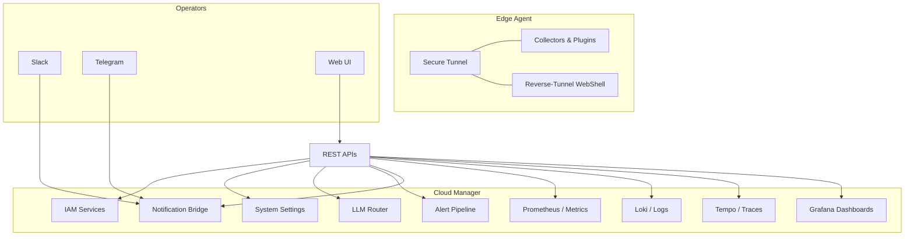
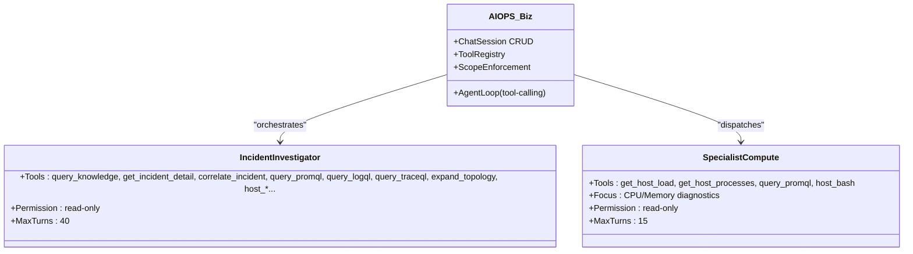
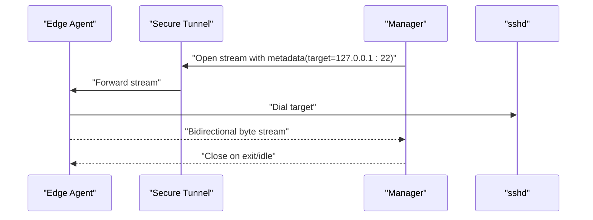
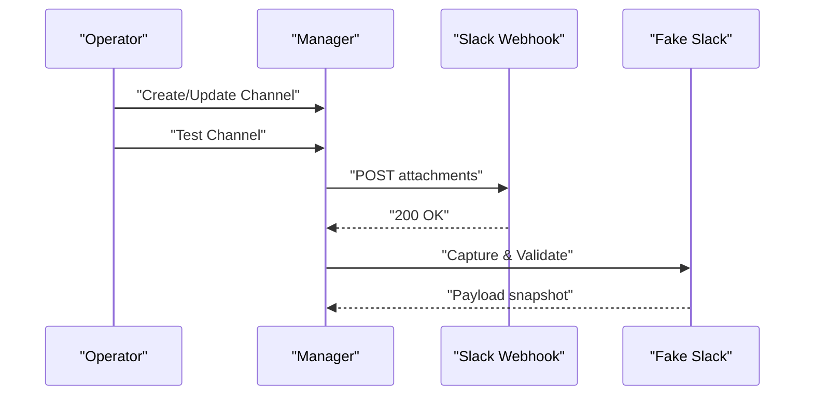
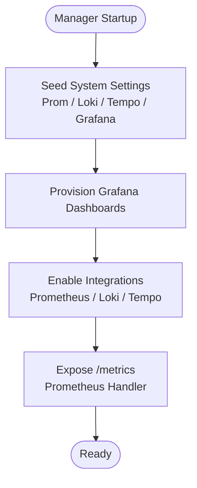
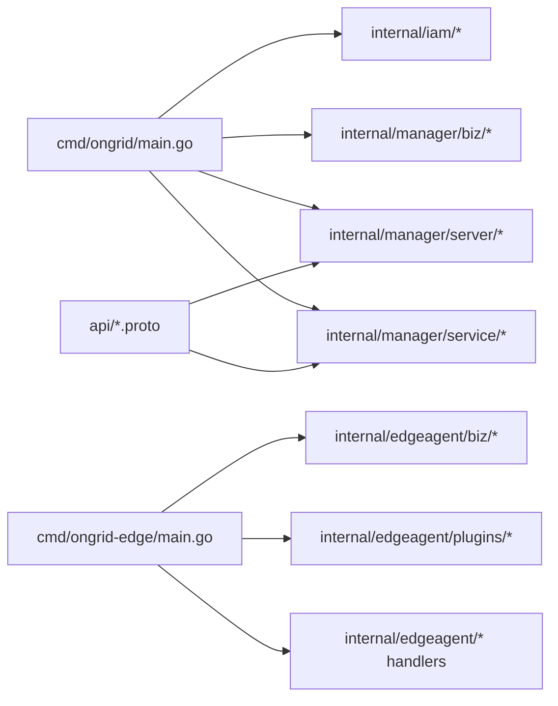

# Project Overview

<cite>
**Referenced Files in This Document**
- [README.md](file://README.md)
- [main.go](file://cmd/ongrid/main.go)
- [main.go](file://cmd/ongrid-edge/main.go)
- [doc.go](file://internal/manager/biz/aiops/doc.go)
- [incident-investigator.md](file://agents/incident-investigator.md)
- [specialist-compute.md](file://agents/specialist-compute.md)
- [api/README.md](file://api/README.md)
- [deploy/README.md](file://deploy/README.md)
- [http.go](file://internal/manager/server/webshell/http.go)
- [handler.go](file://internal/edgeagent/webshell/handler.go)
- [fakes.go](file://tests/e2e/testenv/fakes.go)
- [notify_slack_test.go](file://tests/e2e/notify_slack_test.go)
</cite>

## Table of Contents
1. [Introduction](#introduction)
2. [Project Structure](#project-structure)
3. [Core Components](#core-components)
4. [Architecture Overview](#architecture-overview)
5. [Detailed Component Analysis](#detailed-component-analysis)
6. [Dependency Analysis](#dependency-analysis)
7. [Performance Considerations](#performance-considerations)
8. [Troubleshooting Guide](#troubleshooting-guide)
9. [Conclusion](#conclusion)

## Introduction
Ongrid is an AI-powered observability and automation platform designed as an ops AI agent that understands infrastructure, finds root causes, and executes fixes through Slack or Telegram. It introduces a dual-agent architecture:
- Coordinator agents orchestrate workflows and dispatch tasks.
- Specialist agents focus on domain expertise (compute, network, disk, SRE, and ops).
- Edge agents run on target hosts to collect telemetry, enforce security policies, and execute read-only diagnostics.

Key value propositions:
- Zero inbound ports: edge agents dial out to the cloud, eliminating firewall complications.
- Browser SSH: reverse-tunnel shell into any host without keys or jumpboxes.
- Alert-driven auto-investigation: incident-investigator agents spawn RCA workers and correlate metrics/logs/traces.
- Built-in observability stack: Prometheus, Loki, Tempo, and Grafana are provisioned and wired by default.
- Bring-your-own-model: supports multiple LLM providers with hot routing and fallbacks.
- Two-way IM channels: integrates with Slack, Telegram, Larksuite, DingTalk, WeCom, and webhooks.

Practical examples:
- Auto-investigation on alerts: when an alert fires, the system spawns an RCA worker to trace the root cause across topology, metrics, logs, and traces.
- Remote execution: operators can run read-only diagnostics or safely propose fixes via a reviewer agent, with every action audited.

Supported platforms and integrations:
- Platforms: Linux distributions (Ubuntu 22.04+, Debian 12+, RHEL/Rocky 9).
- Observability: Prometheus, Grafana, Loki, Tempo, OpenTelemetry.
- Channels: Slack, Telegram, Larksuite, DingTalk, WeCom, Webhooks.
- Models: OpenAI, Anthropic, Gemini, DeepSeek, GLM, Kimi, and CheryGPT/Dify fallback.

**Section sources**
- [README.md:1-96](file://README.md#L1-L96)

## Project Structure
High-level structure:
- cmd/ongrid: cloud-side manager binary composing IAM and manager bounded contexts, exposing HTTP APIs and Prometheus metrics.
- cmd/ongrid-edge: edge-side agent binary that opens tunnels, pushes host metrics, and serves tool RPC handlers.
- internal/manager: manager business logic, servers, services, and integrations (IAM, alerting, AI/ops, topology, knowledge, notifications, skills).
- internal/edgeagent: edge agent runtime, collectors, plugins, and webshell forwarder.
- agents/: curated agent definitions (incident-investigator, specialist-*).
- api/: protobuf contracts for public APIs.
- deploy/: Docker images, docker-compose, installation assets, and observability provisioning.
- web/: React-based frontend integrating with manager APIs.
- tests/e2e: end-to-end tests including notification channel integrations.

```mermaid
graph TB
subgraph "Cloud"
Manager["cmd/ongrid<br/>Manager Binary"]
API["API Contracts<br/>api/*.proto"]
ManagerBiz["internal/manager/*<br/>Biz/Server/Service"]
Web["web/*<br/>Frontend"]
end
subgraph "Edge"
EdgeAgent["cmd/ongrid-edge<br/>Edge Agent"]
EdgePlugins["internal/edgeagent/*<br/>Collectors/Plugins/WebShell"]
end
subgraph "Observability"
Prom["Prometheus"]
Graf["Grafana"]
Loki["Loki"]
Tempo["Tempo"]
end
subgraph "IM"
Slack["Slack"]
Telegram["Telegram"]
Webhook["Webhook Providers"]
end
Manager --> API
Manager --> ManagerBiz
Manager <- --> EdgeAgent
ManagerBiz --> Prom
ManagerBiz --> Graf
ManagerBiz --> Loki
ManagerBiz --> Tempo
ManagerBiz --> Slack
ManagerBiz --> Telegram
ManagerBiz --> Webhook
EdgeAgent --> EdgePlugins
Web --> Manager
```

**Diagram sources**
- [main.go:1-160](file://cmd/ongrid/main.go#L1-L160)
- [main.go:1-120](file://cmd/ongrid-edge/main.go#L1-L120)
- [api/README.md:1-41](file://api/README.md#L1-L41)
- [deploy/README.md:1-130](file://deploy/README.md#L1-L130)

**Section sources**
- [main.go:1-160](file://cmd/ongrid/main.go#L1-L160)
- [main.go:1-120](file://cmd/ongrid-edge/main.go#L1-L120)
- [api/README.md:1-41](file://api/README.md#L1-L41)
- [deploy/README.md:1-130](file://deploy/README.md#L1-L130)

## Core Components
- Coordinator + Specialist agents: the coordinator dispatches to domain experts (SRE, compute, network, disk, ops) based on the problem scope.
- Edge agents: lightweight daemons that dial out, push host metrics, run plugins, and forward streams for browser SSH.
- AI/ops subsystem: orchestrates chat sessions, tool registries, and scope enforcement; integrates with LLM routers and knowledge bases.
- Notification bridge: two-way channels to Slack, Telegram, and webhooks; supports test posts and formatted attachments.
- Built-in observability: Prometheus scraping, Loki log ingestion, Tempo trace collection, and Grafana dashboards provisioned by default.

**Section sources**
- [README.md:31-43](file://README.md#L31-L43)
- [doc.go:1-8](file://internal/manager/biz/aiops/doc.go#L1-L8)
- [incident-investigator.md:1-117](file://agents/incident-investigator.md#L1-L117)
- [specialist-compute.md:1-69](file://agents/specialist-compute.md#L1-L69)

## Architecture Overview
End-to-end architecture:
- Cloud manager initializes IAM, settings, LLM clients, and observability integrations; exposes REST APIs and Prometheus metrics.
- Edge agent establishes a secure tunnel to the cloud, registers capabilities, pushes metrics, and forwards streams for browser SSH.
- AI/ops tools and skills enable read-only diagnostics and coordinated remediation; every action is audited.
- Notifications integrate with IM providers; tests validate webhook payloads and attachments.



**Diagram sources**
- [main.go:165-738](file://cmd/ongrid/main.go#L165-L738)
- [main.go:55-301](file://cmd/ongrid-edge/main.go#L55-L301)
- [deploy/README.md:28-64](file://deploy/README.md#L28-L64)

## Detailed Component Analysis

### AIOps Orchestration and Agents
- AI/ops biz layer: manages chat sessions, agent loops, tool registries, and scope enforcement across manager and edge boundaries.
- Agent definitions: curated prompts and tool sets for incident-investigator and specialist agents, enforcing read-only modes and iteration caps.
- Tooling: structured telemetry queries (PromQL, LogQL, TraceQL), topology traversal, host diagnostics, and knowledge retrieval.



**Diagram sources**
- [doc.go:1-8](file://internal/manager/biz/aiops/doc.go#L1-L8)
- [incident-investigator.md:15-47](file://agents/incident-investigator.md#L15-L47)
- [specialist-compute.md:19-29](file://agents/specialist-compute.md#L19-L29)

**Section sources**
- [doc.go:1-8](file://internal/manager/biz/aiops/doc.go#L1-L8)
- [incident-investigator.md:1-117](file://agents/incident-investigator.md#L1-L117)
- [specialist-compute.md:1-69](file://agents/specialist-compute.md#L1-L69)

### Edge Agent Runtime and Security
- Tunnel-first connectivity: edge agents dial out to the cloud; no inbound ports required.
- Capability registration: host_files, restart_service, bash skills gated by sandbox policies; plugins for logs, traces, metrics, custom metrics, databases, hostmetrics, and procmetrics.
- WebSSH: edge acts as a stream forwarder; manager initiates SSH sessions via a secure tunnel.



**Diagram sources**
- [main.go:142-147](file://cmd/ongrid-edge/main.go#L142-L147)
- [handler.go:35-145](file://internal/edgeagent/webshell/handler.go#L35-L145)
- [http.go:204-605](file://internal/manager/server/webshell/http.go#L204-L605)

**Section sources**
- [main.go:88-150](file://cmd/ongrid-edge/main.go#L88-L150)
- [handler.go:54-138](file://internal/edgeagent/webshell/handler.go#L54-L138)
- [http.go:204-432](file://internal/manager/server/webshell/http.go#L204-L432)

### Notification Bridge and Channels
- Provider support: Slack, Telegram, Larksuite, DingTalk, WeCom, and generic webhooks.
- Test posts and attachment formatting validated by end-to-end tests; fake providers capture webhook payloads for assertions.



**Diagram sources**
- [notify_slack_test.go:39-76](file://tests/e2e/notify_slack_test.go#L39-L76)
- [fakes.go:166-204](file://tests/e2e/testenv/fakes.go#L166-L204)

**Section sources**
- [notify_slack_test.go:39-76](file://tests/e2e/notify_slack_test.go#L39-L76)
- [fakes.go:166-204](file://tests/e2e/testenv/fakes.go#L166-L204)

### Observability Stack and Integrations
- Prometheus scraping and metrics exposure; Loki for logs; Tempo for traces; Grafana dashboards provisioned by default.
- Manager seeds system settings for Prom, Loki, Tempo, and Grafana; Grafana mirror sync for user-managed panels.



**Diagram sources**
- [main.go:397-451](file://cmd/ongrid/main.go#L397-L451)
- [deploy/README.md:45-64](file://deploy/README.md#L45-L64)

**Section sources**
- [main.go:397-451](file://cmd/ongrid/main.go#L397-L451)
- [deploy/README.md:28-64](file://deploy/README.md#L28-L64)

## Dependency Analysis
- Manager binary composes IAM, alerting, AI/ops, topology, knowledge, metrics, monitoring, reports, settings, and webshell services.
- Edge agent depends on tunnel client, collectors, plugins, and skill registry; registers handlers for host_files, restart_service, bash, and webshell.
- API contracts define protobuf packages for manager, edge, metric, AI/ops, and tunnel payloads.



**Diagram sources**
- [main.go:15-160](file://cmd/ongrid/main.go#L15-L160)
- [main.go:5-46](file://cmd/ongrid-edge/main.go#L5-L46)
- [api/README.md:8-19](file://api/README.md#L8-L19)

**Section sources**
- [main.go:15-160](file://cmd/ongrid/main.go#L15-L160)
- [main.go:5-46](file://cmd/ongrid-edge/main.go#L5-L46)
- [api/README.md:8-19](file://api/README.md#L8-L19)

## Performance Considerations
- Collector modes: off/auto/embedded/scrape allow tuning telemetry overhead and scraping behavior per deployment.
- Plugin supervision: health snapshots and restart counters help operators monitor plugin reliability.
- Metrics exposure: Prometheus /metrics endpoint and manager-side metrics for alert evaluation and remote write outcomes.
- LLM routing: multi-client with provider-specific models and fallback ensures cost and latency efficiency.

[No sources needed since this section provides general guidance]

## Troubleshooting Guide
Common scenarios:
- Edge agent not appearing online: stale “online” rows are healed on manager startup using thresholds; investigate last_seen_at and offline thresholds.
- Orphaned investigations: on startup, pending/running investigations are failed to prevent UI deadlocks.
- WebSSH idle timeouts: sessions terminate after prolonged inactivity; verify terminal settings and activity.
- Notification channel issues: use test endpoints to validate webhook URLs and attachment shapes; fake providers capture payloads for inspection.

**Section sources**
- [main.go:746-781](file://cmd/ongrid/main.go#L746-L781)
- [http.go:399-432](file://internal/manager/server/webshell/http.go#L399-L432)
- [notify_slack_test.go:39-76](file://tests/e2e/notify_slack_test.go#L39-L76)
- [fakes.go:166-204](file://tests/e2e/testenv/fakes.go#L166-L204)

## Conclusion
Ongrid delivers a modern AIOps platform centered on AI-driven observability and automation. Its dual-agent architecture combines coordinator and specialist agents with edge agents that securely connect to the cloud, enabling zero-inbound operations and browser SSH. The platform’s built-in observability stack, flexible LLM routing, and robust notification integrations streamline incident response and remediation, while strict sandboxing and auditing ensure safe, auditable automation.

[No sources needed since this section summarizes without analyzing specific files]