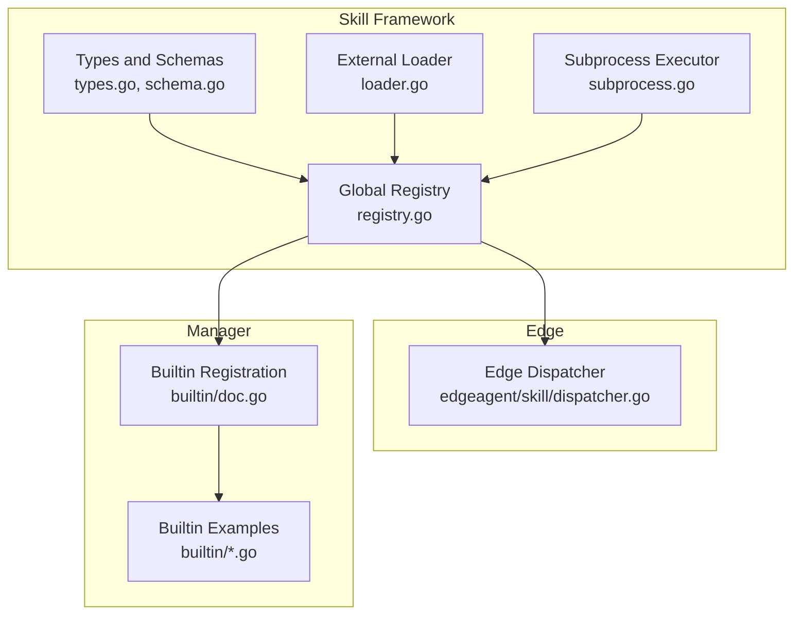
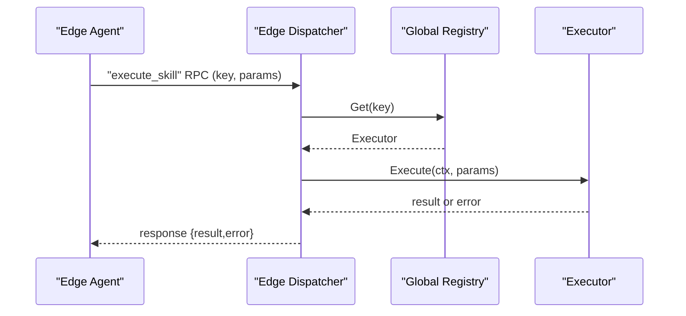
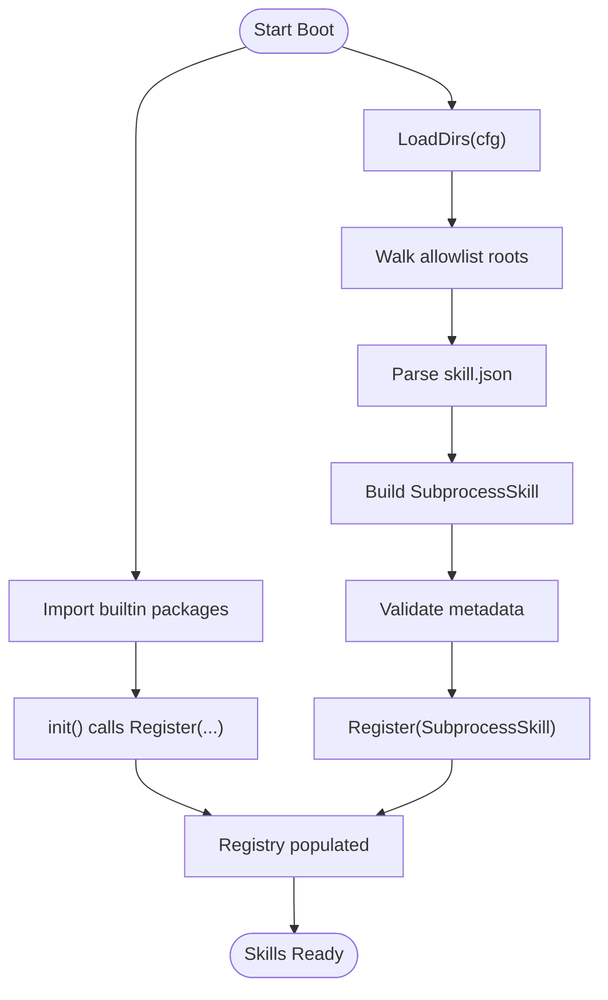
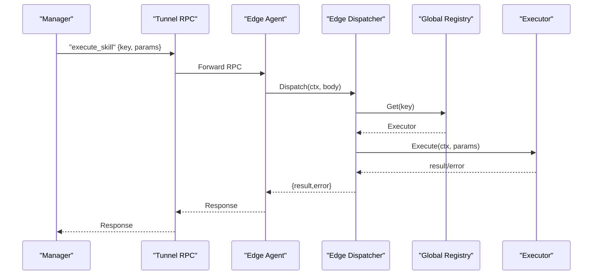
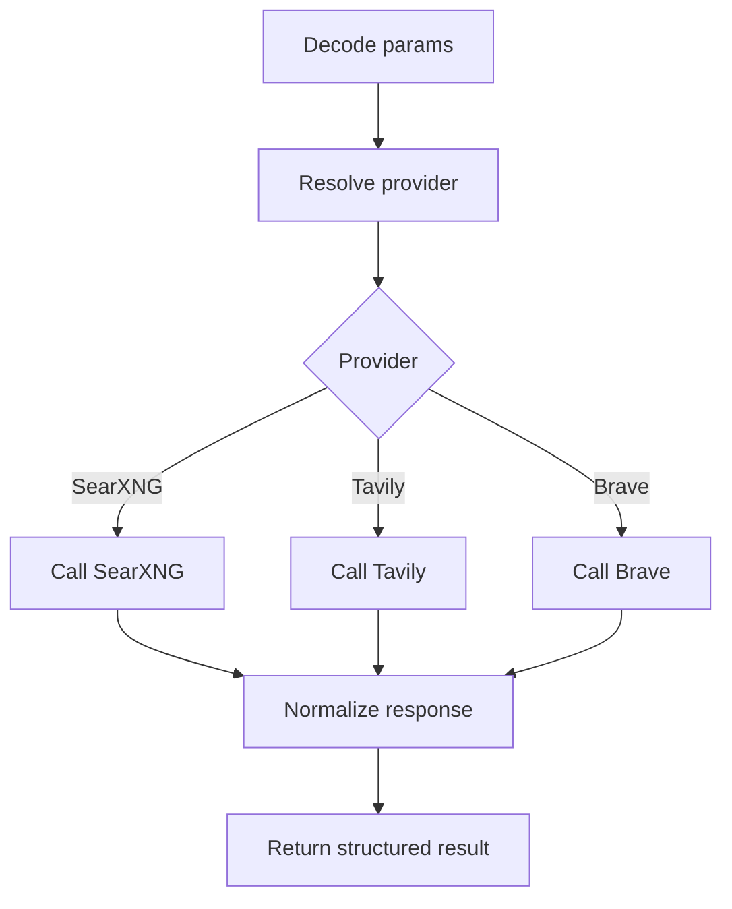
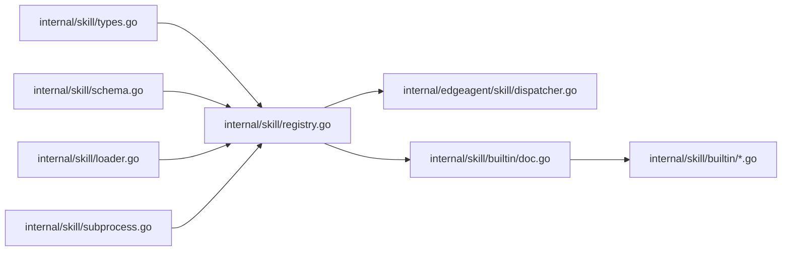

# Custom Skill Development

<cite>
**Referenced Files in This Document**
- [types.go](file://internal/skill/types.go)
- [schema.go](file://internal/skill/schema.go)
- [registry.go](file://internal/skill/registry.go)
- [loader.go](file://internal/skill/loader.go)
- [subprocess.go](file://internal/skill/subprocess.go)
- [subprocess_process_unix.go](file://internal/skill/subprocess_process_unix.go)
- [subprocess_process_windows.go](file://internal/skill/subprocess_process_windows.go)
- [dispatcher.go](file://internal/edgeagent/skill/dispatcher.go)
- [builtin/doc.go](file://internal/skill/builtin/doc.go)
- [builtin/host_netns_inspect.go](file://internal/skill/builtin/host_netns_inspect.go)
- [builtin/web_search.go](file://internal/skill/builtin/web_search.go)
- [builtin/probe_http.go](file://internal/skill/builtin/probe_http.go)
- [builtin/tail_file.go](file://internal/skill/builtin/tail_file.go)
- [SKILL.md](file://skills/bash/SKILL.md)
</cite>

## Table of Contents
1. [Introduction](#introduction)
2. [Project Structure](#project-structure)
3. [Core Components](#core-components)
4. [Architecture Overview](#architecture-overview)
5. [Detailed Component Analysis](#detailed-component-analysis)
6. [Dependency Analysis](#dependency-analysis)
7. [Performance Considerations](#performance-considerations)
8. [Troubleshooting Guide](#troubleshooting-guide)
9. [Conclusion](#conclusion)
10. [Appendices](#appendices)

## Introduction
This document explains how to develop custom skills in the system. It covers the skill schema definition, executor implementation, registration patterns, metadata specification, execution context handling, skill loading and discovery, and integration with the global registry. It also provides step-by-step tutorials for creating custom skills (YAML schema definition, Go implementation patterns, and testing strategies), practical examples for bash scripts, system commands, and external API integrations, plus packaging, distribution, deployment, common development patterns, error handling, and performance optimization techniques.

## Project Structure
The skill framework is implemented in the internal/skill package and integrated with edge and manager components:
- Core framework types, schema derivation, and registry
- Edge-side dispatcher for device-directed skills
- Manager-side subprocess skill loader and executor
- Example builtin skills demonstrating different skill types

**Diagram sources**
- [types.go:1-241](file://internal/skill/types.go#L1-L241)
- [schema.go:1-96](file://internal/skill/schema.go#L1-L96)
- [registry.go:1-127](file://internal/skill/registry.go#L1-L127)
- [loader.go:1-274](file://internal/skill/loader.go#L1-L274)
- [subprocess.go:1-268](file://internal/skill/subprocess.go#L1-L268)
- [dispatcher.go:1-56](file://internal/edgeagent/skill/dispatcher.go#L1-L56)
- [builtin/doc.go:1-26](file://internal/skill/builtin/doc.go#L1-L26)

**Section sources**
- [types.go:1-241](file://internal/skill/types.go#L1-L241)
- [registry.go:1-127](file://internal/skill/registry.go#L1-L127)
- [loader.go:1-274](file://internal/skill/loader.go#L1-L274)
- [subprocess.go:1-268](file://internal/skill/subprocess.go#L1-L268)
- [dispatcher.go:1-56](file://internal/edgeagent/skill/dispatcher.go#L1-L56)
- [builtin/doc.go:1-26](file://internal/skill/builtin/doc.go#L1-L26)

## Core Components
- Skill Metadata: Defines the skill’s identity, permissions, scope, parameters, and previews.
- Executor Interface: Encapsulates Metadata() and Execute(ctx, params) for execution.
- Schema Builder: Converts ParamSchema to JSON Schema for LLM tooling.
- Global Registry: Central catalog of skills with thread-safe operations.
- Edge Dispatcher: Translates RPC requests into executor invocations.
- Subprocess Skill: Runs external executables with strict security and resource limits.
- External Loader: Discovers and registers external skill packs from disk.

Key responsibilities:
- Metadata validation ensures consistent and secure skill definitions.
- Executors run on the appropriate side (host vs manager) based on Scope.
- Registry guarantees uniqueness and provides filtering by class.
- SubprocessSkill enforces allowlists, timeouts, and environment constraints.
- Loader scans configured directories and registers external skills safely.

**Section sources**
- [types.go:99-203](file://internal/skill/types.go#L99-L203)
- [schema.go:5-20](file://internal/skill/schema.go#L5-L20)
- [registry.go:10-54](file://internal/skill/registry.go#L10-L54)
- [dispatcher.go:16-44](file://internal/edgeagent/skill/dispatcher.go#L16-L44)
- [subprocess.go:30-97](file://internal/skill/subprocess.go#L30-L97)
- [loader.go:13-53](file://internal/skill/loader.go#L13-L53)

## Architecture Overview
The skill architecture integrates three sides:
- Edge: Executes host-scoped skills via RPC dispatch.
- Manager: Provides manager-scoped skills and external subprocess skills.
- Global Registry: Shared catalog enabling discovery and tool generation.

**Diagram sources**
- [dispatcher.go:24-44](file://internal/edgeagent/skill/dispatcher.go#L24-L44)
- [registry.go:35-40](file://internal/skill/registry.go#L35-L40)

**Section sources**
- [dispatcher.go:16-44](file://internal/edgeagent/skill/dispatcher.go#L16-L44)
- [registry.go:10-54](file://internal/skill/registry.go#L10-L54)

## Detailed Component Analysis

### Skill Interface and Metadata
- Metadata fields include Key, Name, Description, Class, Scope, Category, Params, and ResultPreview.
- Validation enforces naming rules, required fields, and param type correctness.
- EffectiveClass and EffectiveScope provide defaults for backward compatibility.

Implementation pattern:
- Define Metadata in the Executor’s Metadata() method.
- Use ParamSchema with ParamDef entries to describe inputs.
- For complex schemas, implement RawSchemaProvider to supply a custom JSON Schema.

Security and permission classes:
- safe: read-only, no side effects.
- mutating: modifies state but reversible.
- dangerous: irreversible or impactful; gating handled by manager policies.

Scope:
- host: executed on the target edge agent.
- manager: executed on the manager side.

**Section sources**
- [types.go:99-175](file://internal/skill/types.go#L99-L175)
- [types.go:205-224](file://internal/skill/types.go#L205-L224)
- [schema.go:22-95](file://internal/skill/schema.go#L22-L95)

### Executor Implementation Patterns
- Native Go skills: implement Executor with Metadata() and Execute().
- Manager-side skills: often HTTP integrations or API calls.
- Host-side skills: direct system commands or probes.

Patterns demonstrated by builtin skills:
- Structured result types with JSON marshaling.
- Defensive parameter decoding and validation.
- Context-aware timeouts and cancellation.
- Graceful handling of platform-specific constraints.

Examples:
- Network namespace inspection (host scope, safe).
- HTTP probing (host scope, safe).
- File tailing (host scope, safe).
- Web search (manager scope, safe, multi-provider).

**Section sources**
- [builtin/host_netns_inspect.go:54-81](file://internal/skill/builtin/host_netns_inspect.go#L54-L81)
- [builtin/probe_http.go:23-47](file://internal/skill/builtin/probe_http.go#L23-L47)
- [builtin/tail_file.go:22-46](file://internal/skill/builtin/tail_file.go#L22-L46)
- [builtin/web_search.go:161-195](file://internal/skill/builtin/web_search.go#L161-L195)

### Registration and Discovery
- Global registry stores Executors keyed by Metadata.Key.
- Register panics on invalid metadata or duplicate keys.
- Blank imports in builtin/doc.go trigger init() registrations across packages.

Discovery mechanisms:
- Internal init() registrations for builtin skills.
- External loader scanning configured directories for skill.json manifests.
- Loader validates manifests, resolves entry paths, and registers SubprocessSkill instances.

**Diagram sources**
- [builtin/doc.go:19-25](file://internal/skill/builtin/doc.go#L19-L25)
- [registry.go:26-74](file://internal/skill/registry.go#L26-L74)
- [loader.go:69-161](file://internal/skill/loader.go#L69-L161)
- [loader.go:176-254](file://internal/skill/loader.go#L176-L254)

**Section sources**
- [builtin/doc.go:19-25](file://internal/skill/builtin/doc.go#L19-L25)
- [registry.go:26-74](file://internal/skill/registry.go#L26-L74)
- [loader.go:69-161](file://internal/skill/loader.go#L69-L161)
- [loader.go:176-254](file://internal/skill/loader.go#L176-L254)

### Execution Context Handling
- Edge dispatcher unmarshals RPC body, validates key presence, and invokes Execute.
- Subprocess executor enforces absolute entry path, executable checks, and environment filtering.
- Context propagation ensures timeouts and cancellations are respected.

**Diagram sources**
- [dispatcher.go:24-44](file://internal/edgeagent/skill/dispatcher.go#L24-L44)
- [registry.go:35-40](file://internal/skill/registry.go#L35-L40)

**Section sources**
- [dispatcher.go:24-44](file://internal/edgeagent/skill/dispatcher.go#L24-L44)
- [subprocess.go:112-172](file://internal/skill/subprocess.go#L112-L172)

### External Subprocess Skills
SubprocessSkill enables integrating external binaries or scripts:
- Manifest-driven discovery with allowlisted entry paths.
- Strict environment forwarding and timeout enforcement.
- Stdout/stderr capping and JSON validation for results.

Security controls:
- Entry must be absolute and reside under allowlisted roots.
- Environment variables are explicitly enumerated.
- Default timeout mirrors typical tool deadlines.

Platform differences:
- Unix sets process group and supports signal-based cancellation.
- Windows uses default command configuration.

**Section sources**
- [subprocess.go:30-97](file://internal/skill/subprocess.go#L30-L97)
- [subprocess.go:112-172](file://internal/skill/subprocess.go#L112-L172)
- [subprocess_process_unix.go:12-26](file://internal/skill/subprocess_process_unix.go#L12-L26)
- [subprocess_process_windows.go:7](file://internal/skill/subprocess_process_windows.go#L7)
- [loader.go:13-53](file://internal/skill/loader.go#L13-L53)
- [loader.go:176-254](file://internal/skill/loader.go#L176-L254)

### Practical Examples

#### Bash Scripts and System Commands
Use host-scoped skills for read-only system exploration. The bash skill documentation outlines allowed commands and restrictions.

Implementation tips:
- Prefer structured tools when available (e.g., host_tail_file, host_probe_http).
- For flexible ad-hoc queries, use host_bash with cmdpolicy sandboxing.

Reference:
- [SKILL.md:1-188](file://skills/bash/SKILL.md#L1-L188)

**Section sources**
- [SKILL.md:1-188](file://skills/bash/SKILL.md#L1-L188)

#### External API Integrations
Manager-side skills integrate with external APIs. The web_search skill demonstrates:
- Multi-provider routing (SearXNG, Tavily, Brave).
- Configurable endpoints and credentials via resolvers.
- Graceful handling of reachability and configuration errors.

**Diagram sources**
- [builtin/web_search.go:228-283](file://internal/skill/builtin/web_search.go#L228-L283)
- [builtin/web_search.go:294-374](file://internal/skill/builtin/web_search.go#L294-L374)
- [builtin/web_search.go:391-455](file://internal/skill/builtin/web_search.go#L391-L455)
- [builtin/web_search.go:485-543](file://internal/skill/builtin/web_search.go#L485-L543)

**Section sources**
- [builtin/web_search.go:161-195](file://internal/skill/builtin/web_search.go#L161-L195)
- [builtin/web_search.go:228-283](file://internal/skill/builtin/web_search.go#L228-L283)
- [builtin/web_search.go:294-374](file://internal/skill/builtin/web_search.go#L294-L374)
- [builtin/web_search.go:391-455](file://internal/skill/builtin/web_search.go#L391-L455)
- [builtin/web_search.go:485-543](file://internal/skill/builtin/web_search.go#L485-L543)

### Step-by-Step Tutorials

#### Tutorial 1: Create a Host-Scoped System Command Skill
Steps:
1. Define Metadata with Key, Name, Description, Class=safe, Scope=host, Category, and Params.
2. Implement Execute(ctx, params) to validate and run the command using os/exec.
3. Marshal a structured result and return json.RawMessage.
4. Register in init() via skill.Register(&YourSkill{}).

References:
- [types.go:99-175](file://internal/skill/types.go#L99-L175)
- [builtin/tail_file.go:22-46](file://internal/skill/builtin/tail_file.go#L22-L46)
- [builtin/probe_http.go:23-47](file://internal/skill/builtin/probe_http.go#L23-L47)

**Section sources**
- [types.go:99-175](file://internal/skill/types.go#L99-L175)
- [builtin/tail_file.go:22-46](file://internal/skill/builtin/tail_file.go#L22-L46)
- [builtin/probe_http.go:23-47](file://internal/skill/builtin/probe_http.go#L23-L47)

#### Tutorial 2: Create a Manager-Scoped API Skill
Steps:
1. Define Metadata with Scope=manager and Params for query and provider selection.
2. Implement Execute(ctx, params) to fetch and normalize data from external APIs.
3. Use a resolver interface to obtain endpoints and credentials.
4. Return structured results; on configuration errors, return a skipped_reason envelope.

References:
- [builtin/web_search.go:161-195](file://internal/skill/builtin/web_search.go#L161-L195)
- [builtin/web_search.go:228-283](file://internal/skill/builtin/web_search.go#L228-L283)

**Section sources**
- [builtin/web_search.go:161-195](file://internal/skill/builtin/web_search.go#L161-L195)
- [builtin/web_search.go:228-283](file://internal/skill/builtin/web_search.go#L228-L283)

#### Tutorial 3: Package and Distribute External Subprocess Skills
Steps:
1. Create a skill.json manifest with name, description, schema (optional), entry, env_allow, timeout_seconds, class, and category.
2. Place the manifest alongside the executable in a dedicated directory.
3. Configure the loader to scan the directory and register skills at startup.
4. Enforce allowlist roots and validate entry paths during build.

References:
- [loader.go:13-53](file://internal/skill/loader.go#L13-L53)
- [loader.go:176-254](file://internal/skill/loader.go#L176-L254)
- [subprocess.go:30-97](file://internal/skill/subprocess.go#L30-L97)

**Section sources**
- [loader.go:13-53](file://internal/skill/loader.go#L13-L53)
- [loader.go:176-254](file://internal/skill/loader.go#L176-L254)
- [subprocess.go:30-97](file://internal/skill/subprocess.go#L30-L97)

### Testing Strategies
- Unit tests for parameter decoding and validation.
- Mock exec.CommandContext for deterministic subprocess behavior.
- Test error paths: invalid params, timeouts, non-zero exit codes, and malformed JSON.
- Verify registry uniqueness and validation failures.

References:
- [subprocess.go:83-85](file://internal/skill/subprocess.go#L83-L85)
- [subprocess.go:112-172](file://internal/skill/subprocess.go#L112-L172)
- [registry.go:59-74](file://internal/skill/registry.go#L59-L74)

**Section sources**
- [subprocess.go:83-85](file://internal/skill/subprocess.go#L83-L85)
- [subprocess.go:112-172](file://internal/skill/subprocess.go#L112-L172)
- [registry.go:59-74](file://internal/skill/registry.go#L59-L74)

## Dependency Analysis
The skill framework exhibits low coupling and high cohesion:
- internal/skill defines the core abstraction and utilities.
- internal/edgeagent/skill depends on internal/skill for dispatch.
- internal/skill/builtin registers concrete skills via init() blank imports.
- Loader and SubprocessSkill depend on the registry for registration.

**Diagram sources**
- [types.go:1-241](file://internal/skill/types.go#L1-L241)
- [schema.go:1-96](file://internal/skill/schema.go#L1-L96)
- [registry.go:1-127](file://internal/skill/registry.go#L1-L127)
- [dispatcher.go:1-56](file://internal/edgeagent/skill/dispatcher.go#L1-L56)
- [builtin/doc.go:1-26](file://internal/skill/builtin/doc.go#L1-L26)
- [loader.go:1-274](file://internal/skill/loader.go#L1-L274)
- [subprocess.go:1-268](file://internal/skill/subprocess.go#L1-L268)

**Section sources**
- [types.go:1-241](file://internal/skill/types.go#L1-L241)
- [schema.go:1-96](file://internal/skill/schema.go#L1-L96)
- [registry.go:1-127](file://internal/skill/registry.go#L1-L127)
- [dispatcher.go:1-56](file://internal/edgeagent/skill/dispatcher.go#L1-L56)
- [builtin/doc.go:1-26](file://internal/skill/builtin/doc.go#L1-L26)
- [loader.go:1-274](file://internal/skill/loader.go#L1-L274)
- [subprocess.go:1-268](file://internal/skill/subprocess.go#L1-L268)

## Performance Considerations
- Use context timeouts to bound execution and prevent resource exhaustion.
- Cap stdout/stderr sizes to limit memory usage for subprocess skills.
- Prefer structured tools over ad-hoc commands to reduce overhead.
- Cache configuration lookups for manager-side skills (resolver caching recommended).
- Minimize external network calls and handle backoff and retries gracefully.

[No sources needed since this section provides general guidance]

## Troubleshooting Guide
Common issues and resolutions:
- Unknown skill key: Ensure the key matches Metadata.Key and is registered.
- Duplicate key: Fix the key or remove duplicates.
- Invalid metadata: Validate types, enums, defaults, and required fields.
- Subprocess entry errors: Confirm absolute path, executable permissions, and allowlist compliance.
- Timeouts: Increase timeout or optimize the underlying operation.
- Non-zero exit or invalid JSON: Inspect stderr tail and validate stdout encoding.

**Section sources**
- [registry.go:64-74](file://internal/skill/registry.go#L64-L74)
- [loader.go:176-254](file://internal/skill/loader.go#L176-L254)
- [subprocess.go:112-172](file://internal/skill/subprocess.go#L112-L172)

## Conclusion
The skill framework provides a robust, secure, and extensible foundation for building custom capabilities. By adhering to metadata standards, implementing proper executors, and leveraging the global registry and loader, developers can create host or manager skills, integrate external subprocesses, and deliver reliable AI-powered automation.

[No sources needed since this section summarizes without analyzing specific files]

## Appendices

### A. Skill Metadata Reference
- Key: Lower snake-case unique identifier.
- Name: Human-readable label.
- Description: Rich text for UI and LLM.
- Class: safe | mutating | dangerous.
- Scope: host | manager.
- Category: grouping label.
- Params: Ordered parameter schema with types, defaults, enums, and item types.
- ResultPreview: One-line hint for UI and LLM.

**Section sources**
- [types.go:99-125](file://internal/skill/types.go#L99-L125)
- [types.go:66-97](file://internal/skill/types.go#L66-L97)

### B. Parameter Types and Constraints
- Supported types: string, int, float, bool, duration, enum, array.
- Array requires ItemType from scalar types.
- Required and Default must be consistent.

**Section sources**
- [types.go:157-173](file://internal/skill/types.go#L157-L173)
- [schema.go:34-95](file://internal/skill/schema.go#L34-L95)

### C. External Skill Manifest Fields
- name: Lower snake-case key.
- description: Tool description.
- schema: Optional raw JSON Schema.
- entry: Executable path (absolute or relative to manifest).
- env_allow: Allowed environment variable names.
- timeout_seconds: Runtime cap.
- class: safe | mutating | dangerous.
- category: Group label.

**Section sources**
- [loader.go:17-53](file://internal/skill/loader.go#L17-L53)