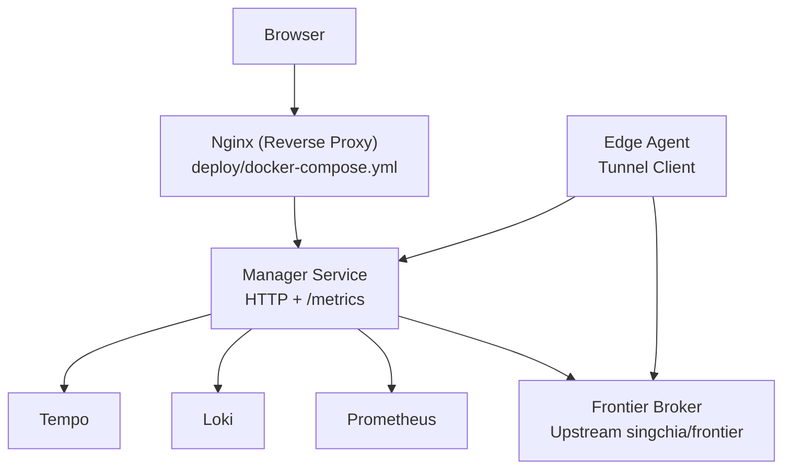
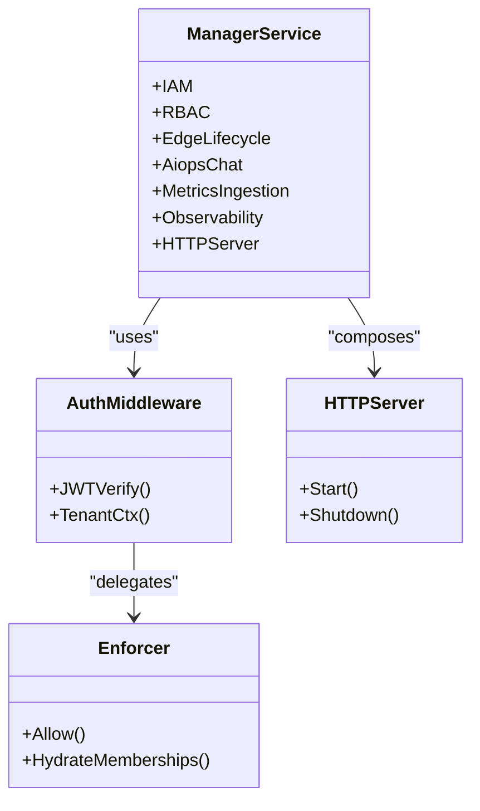
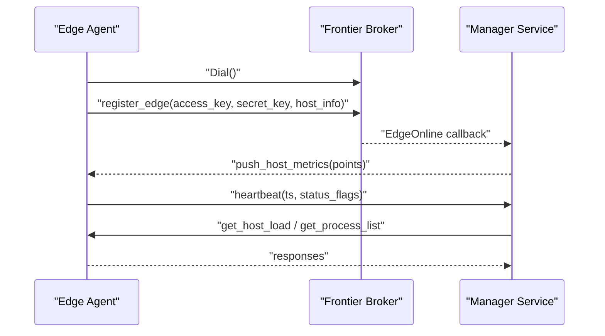
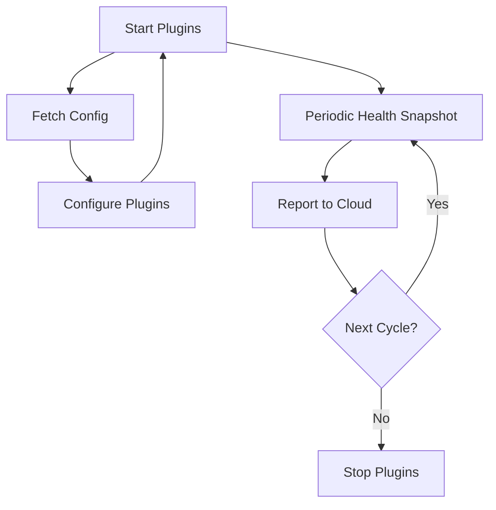
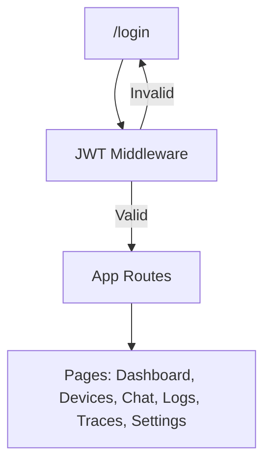
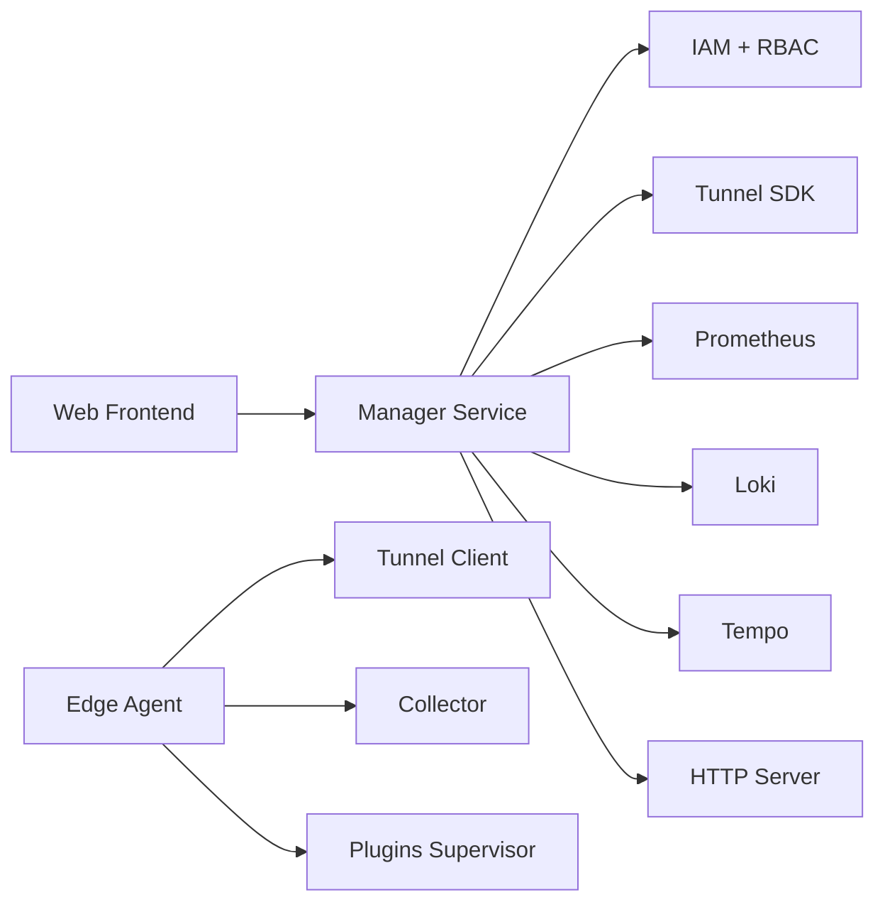
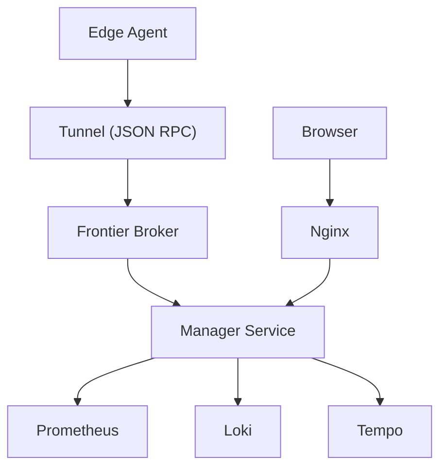

# System Architecture

<cite>
**Referenced Files in This Document**
- [main.go](file://cmd/ongrid/main.go)
- [main.go](file://cmd/ongrid-edge/main.go)
- [docker-compose.yml](file://deploy/docker-compose.yml)
- [edge.proto](file://api/manager/edge/v1/edge.proto)
- [tunnel.proto](file://api/tunnel/v1/tunnel.proto)
- [aiops.proto](file://api/manager/aiops/v1/aiops.proto)
- [types.go](file://internal/pkg/tunnel/types.go)
- [handlers.go](file://internal/edgeagent/service/handlers.go)
- [plugin.go](file://internal/edgeagent/plugins/plugin.go)
- [App.tsx](file://web/src/App.tsx)
- [server.go](file://internal/pkg/httpserver/server.go)
- [middleware.go](file://internal/pkg/auth/middleware.go)
- [authz.go](file://internal/iam/biz/authz/authz.go)
</cite>

## Table of Contents
1. [Introduction](#introduction)
2. [Project Structure](#project-structure)
3. [Core Components](#core-components)
4. [Architecture Overview](#architecture-overview)
5. [Detailed Component Analysis](#detailed-component-analysis)
6. [Dependency Analysis](#dependency-analysis)
7. [Performance Considerations](#performance-considerations)
8. [Troubleshooting Guide](#troubleshooting-guide)
9. [Conclusion](#conclusion)
10. [Appendices](#appendices)

## Introduction
This document describes the Ongrid system architecture, focusing on the cloud manager service, edge agent service, and web application. It explains the microservices architecture, edge-cloud communication via bidirectional tunnels, and plugin-based extensibility. It also documents system boundaries, data flows across the observability stack (Prometheus, Loki, Tempo), integration patterns with external services, infrastructure requirements, scalability considerations, deployment topology, and cross-cutting concerns such as security (zero inbound ports), monitoring, and disaster recovery.

## Project Structure
The repository is organized around:
- cmd: entry points for cloud manager and edge agent binaries
- internal: Go packages implementing business logic, services, and infrastructure
- api: Protocol Buffer definitions for service contracts
- deploy: Docker Compose and installation artifacts
- web: React-based frontend application
- docs: Architectural and operational documentation

```mermaid
graph TB
subgraph "Cloud Side"
Manager["Manager Service<br/>cmd/ongrid/main.go"]
Frontend["Web Frontend<br/>web/src/App.tsx"]
Broker["Frontier Broker<br/>deploy/docker-compose.yml"]
end
subgraph "Edge Side"
EdgeAgent["Edge Agent<br/>cmd/ongrid-edge/main.go"]
Plugins["Plugins Runtime<br/>internal/edgeagent/plugins/plugin.go"]
end
subgraph "Observability"
Prom["Prometheus"]
Loki["Loki"]
Tempo["Tempo"]
end
Frontend --> Manager
Manager <- --> Broker
EdgeAgent <- --> Broker
EdgeAgent --> Plugins
Manager --> Prom
Manager --> Loki
Manager --> Tempo
```

**Diagram sources**
- [docker-compose.yml:13-398](file://deploy/docker-compose.yml#L13-L398)
- [main.go:165-3154](file://cmd/ongrid/main.go#L165-L3154)
- [main.go:55-410](file://cmd/ongrid-edge/main.go#L55-L410)
- [plugin.go:18-52](file://internal/edgeagent/plugins/plugin.go#L18-L52)

**Section sources**
- [docker-compose.yml:1-398](file://deploy/docker-compose.yml#L1-L398)

## Core Components
- Cloud Manager Service (cmd/ongrid): Provides IAM, alerting, AIOPS chat, metrics ingestion, and observability integrations. It orchestrates tunnel connectivity via the upstream Frontier broker and exposes HTTP APIs and Prometheus metrics.
- Edge Agent Service (cmd/ongrid-edge): Establishes a persistent tunnel to the cloud, registers edge identity, pushes host metrics, and exposes tool RPC handlers. It hosts a plugin runtime for logs, traces, metrics, and custom telemetry.
- Web Application (web/src/App.tsx): Single-page React application routing to dashboards, device management, chat, logs, traces, and settings. It proxies API requests through the cloud manager.

Key architectural patterns:
- Microservices: distinct cloud manager and edge agent binaries with clear separation of concerns.
- Edge-cloud tunneling: bidirectional communication over geminio streams with JSON-encoded payloads.
- Plugin-based extensibility: modular capabilities managed by a supervisor and configurable at runtime.

**Section sources**
- [main.go:165-3154](file://cmd/ongrid/main.go#L165-L3154)
- [main.go:55-410](file://cmd/ongrid-edge/main.go#L55-L410)
- [App.tsx:68-174](file://web/src/App.tsx#L68-L174)

## Architecture Overview
The system uses a broker-mediated topology:
- Cloud manager runs on the cloud side and exposes HTTP APIs and metrics.
- Edge agent runs on remote hosts and initiates outbound connections to the broker.
- Bidirectional streams enable cloud-initiated RPCs (e.g., tool execution) and edge-initiated telemetry (metrics, logs, traces).
- Observability backends (Prometheus, Loki, Tempo) integrate with the cloud manager and are exposed through the web application.



**Diagram sources**
- [docker-compose.yml:176-220](file://deploy/docker-compose.yml#L176-L220)
- [main.go:188-211](file://cmd/ongrid/main.go#L188-L211)
- [main.go:88-94](file://cmd/ongrid-edge/main.go#L88-L94)

## Detailed Component Analysis

### Cloud Manager Service
Responsibilities:
- IAM and RBAC enforcement via JWT and Casbin.
- Edge lifecycle management (registration, listing, rotation).
- AIOPS chat sessions and streaming responses.
- Metrics ingestion and integration with Prometheus.
- Observability integrations for logs (Loki) and traces (Tempo).
- HTTP server with graceful shutdown and Prometheus metrics registry.

Security:
- JWT-based authentication middleware.
- RBAC via Casbin policies.
- Zero inbound ports for the manager service in the provided compose setup.

Observability:
- Prometheus metrics endpoint for self-observability.
- OpenTelemetry tracing initialization for Tempo.



**Diagram sources**
- [main.go:247-356](file://cmd/ongrid/main.go#L247-L356)
- [middleware.go:21-53](file://internal/pkg/auth/middleware.go#L21-L53)
- [authz.go:46-84](file://internal/iam/biz/authz/authz.go#L46-L84)
- [server.go:14-29](file://internal/pkg/httpserver/server.go#L14-L29)

**Section sources**
- [main.go:188-211](file://cmd/ongrid/main.go#L188-L211)
- [middleware.go:10-68](file://internal/pkg/auth/middleware.go#L10-L68)
- [authz.go:112-143](file://internal/iam/biz/authz/authz.go#L112-L143)
- [server.go:31-59](file://internal/pkg/httpserver/server.go#L31-L59)

### Edge Agent Service
Responsibilities:
- Establish and maintain a tunnel to the cloud via the broker.
- Register edge identity and heartbeat.
- Push host metrics periodically.
- Expose tool RPC handlers for cloud-initiated actions.
- Manage plugins (logs, traces, metrics, custom metrics, database metrics, host/process metrics).

Communication:
- Uses tunnel client interface for bidirectional RPCs and streams.
- Handlers marshal/unmarshal JSON payloads for tool calls.



**Diagram sources**
- [main.go:88-106](file://cmd/ongrid-edge/main.go#L88-L106)
- [handlers.go:39-67](file://internal/edgeagent/service/handlers.go#L39-L67)
- [tunnel.proto:48-103](file://api/tunnel/v1/tunnel.proto#L48-L103)

**Section sources**
- [main.go:88-106](file://cmd/ongrid-edge/main.go#L88-L106)
- [handlers.go:19-68](file://internal/edgeagent/service/handlers.go#L19-L68)
- [types.go:68-106](file://internal/pkg/tunnel/types.go#L68-L106)

### Plugin-Based Extensibility
The edge agent includes a plugin supervisor that:
- Fetches configuration from the cloud (via tunnel) or environment.
- Manages lifecycle of in-process and subprocess plugins.
- Reports health snapshots to the cloud.

Supported signals:
- Metrics (in-process scraping and pushing).
- Logs (subprocess promtail).
- Traces (subprocess otelcol-contrib).
- Custom metrics and database metrics.



**Diagram sources**
- [plugin.go:18-52](file://internal/edgeagent/plugins/plugin.go#L18-L52)
- [main.go:182-292](file://cmd/ongrid-edge/main.go#L182-L292)

**Section sources**
- [plugin.go:54-119](file://internal/edgeagent/plugins/plugin.go#L54-L119)
- [main.go:182-292](file://cmd/ongrid-edge/main.go#L182-L292)

### Web Application
The React frontend:
- Routes to dashboards, device management, chat, logs, traces, and settings.
- Authenticates via JWT and enforces protected routes.
- Proxies API calls through the cloud manager.



**Diagram sources**
- [App.tsx:53-66](file://web/src/App.tsx#L53-L66)

**Section sources**
- [App.tsx:68-174](file://web/src/App.tsx#L68-L174)
- [middleware.go:10-68](file://internal/pkg/auth/middleware.go#L10-L68)

## Dependency Analysis
High-level dependencies:
- Cloud manager depends on IAM, RBAC, tunnel SDK, Prometheus, Loki, Tempo, and HTTP server.
- Edge agent depends on tunnel client, collector, and plugin supervisor.
- Web application depends on cloud manager APIs and authentication.



**Diagram sources**
- [main.go:165-3154](file://cmd/ongrid/main.go#L165-L3154)
- [main.go:55-410](file://cmd/ongrid-edge/main.go#L55-L410)
- [docker-compose.yml:13-398](file://deploy/docker-compose.yml#L13-L398)

**Section sources**
- [main.go:165-3154](file://cmd/ongrid/main.go#L165-L3154)
- [main.go:55-410](file://cmd/ongrid-edge/main.go#L55-L410)
- [docker-compose.yml:13-398](file://deploy/docker-compose.yml#L13-L398)

## Performance Considerations
- Edge metrics collection modes: embedded, scrape, auto, and off. Choose based on resource constraints and data-plane requirements.
- Plugin supervision: periodic health snapshots and restarts prevent silent failures.
- Observability backends: Prometheus retention and Loki/Tempo throughput should scale with fleet size.
- Tunnel reliability: exponential backoff and re-registration on reconnect minimize downtime.

[No sources needed since this section provides general guidance]

## Troubleshooting Guide
Common areas:
- Authentication failures: verify JWT token presence and validity; check middleware extraction logic.
- RBAC denials: review Casbin policies and membership hydration.
- Tunnel connectivity: inspect edge registration, heartbeat, and reconnection callbacks.
- Plugin crashes: review health snapshots and restart counts.

**Section sources**
- [middleware.go:21-68](file://internal/pkg/auth/middleware.go#L21-L68)
- [authz.go:233-247](file://internal/iam/biz/authz/authz.go#L233-L247)
- [main.go:96-106](file://cmd/ongrid-edge/main.go#L96-L106)
- [plugin.go:81-106](file://internal/edgeagent/plugins/plugin.go#L81-L106)

## Conclusion
Ongrid employs a robust microservices architecture with clear cloud-edge boundaries, broker-mediated bidirectional tunnels, and a plugin-driven extensibility model. The system integrates Prometheus, Loki, and Tempo for observability, supports zero-inbound security posture, and provides scalable deployment via container orchestration. The React web application offers a cohesive user experience while delegating business logic to the cloud manager.

[No sources needed since this section summarizes without analyzing specific files]

## Appendices

### System Context Diagrams
- Cloud-edge communication via bidirectional tunnels
- Data flows for metrics, logs, and traces
- Integration points with external services



**Diagram sources**
- [tunnel.proto:1-166](file://api/tunnel/v1/tunnel.proto#L1-L166)
- [docker-compose.yml:176-220](file://deploy/docker-compose.yml#L176-L220)
- [main.go:188-211](file://cmd/ongrid/main.go#L188-L211)

### API Definitions and Contracts
- Edge management RPCs (create/list/get/delete/rotate)
- Tunnel RPCs (register, heartbeat, push metrics, tool calls)
- AIOPS chat RPCs (create/list/messages/stream)

**Section sources**
- [edge.proto:13-29](file://api/manager/edge/v1/edge.proto#L13-L29)
- [tunnel.proto:48-166](file://api/tunnel/v1/tunnel.proto#L48-L166)
- [aiops.proto:11-29](file://api/manager/aiops/v1/aiops.proto#L11-L29)

### Security and Compliance
- JWT-based authentication with bearer token extraction
- RBAC via Casbin policies and membership synchronization
- Zero inbound ports in the provided compose setup

**Section sources**
- [middleware.go:10-68](file://internal/pkg/auth/middleware.go#L10-L68)
- [authz.go:112-143](file://internal/iam/biz/authz/authz.go#L112-L143)
- [docker-compose.yml:169-173](file://deploy/docker-compose.yml#L169-L173)

### Infrastructure Requirements and Deployment Topology
- Cloud manager: HTTP API, metrics, and observability backends
- Edge agent: tunnel client, collector, and plugin supervisor
- Broker: upstream singchia/frontier container
- Web: Nginx reverse proxy serving the SPA and API

**Section sources**
- [docker-compose.yml:13-398](file://deploy/docker-compose.yml#L13-L398)
- [main.go:165-3154](file://cmd/ongrid/main.go#L165-L3154)
- [main.go:55-410](file://cmd/ongrid-edge/main.go#L55-L410)