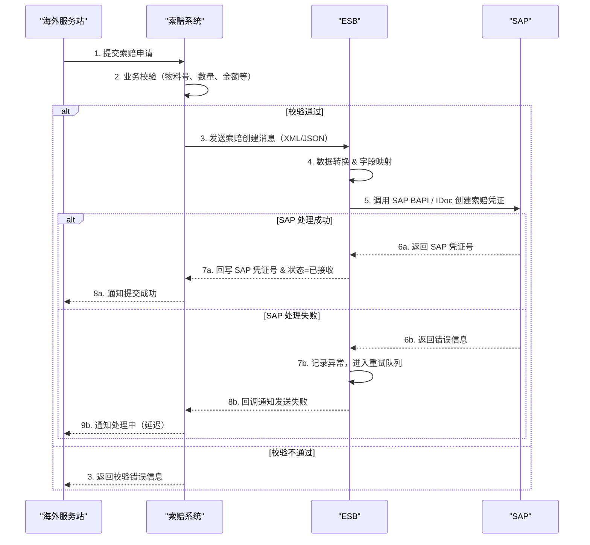
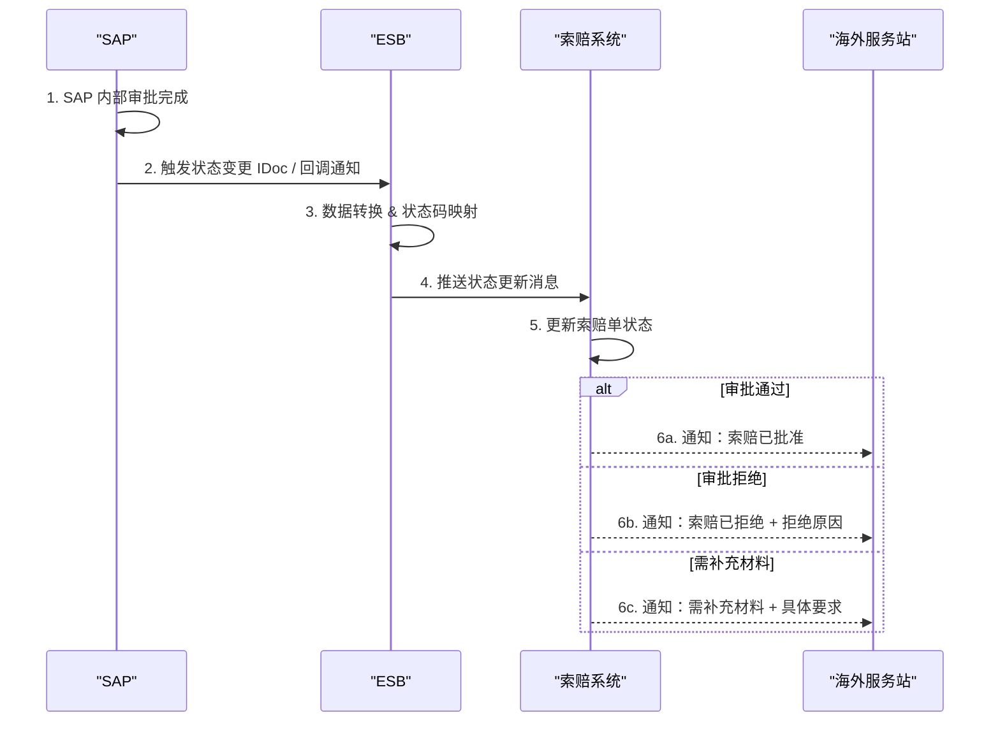
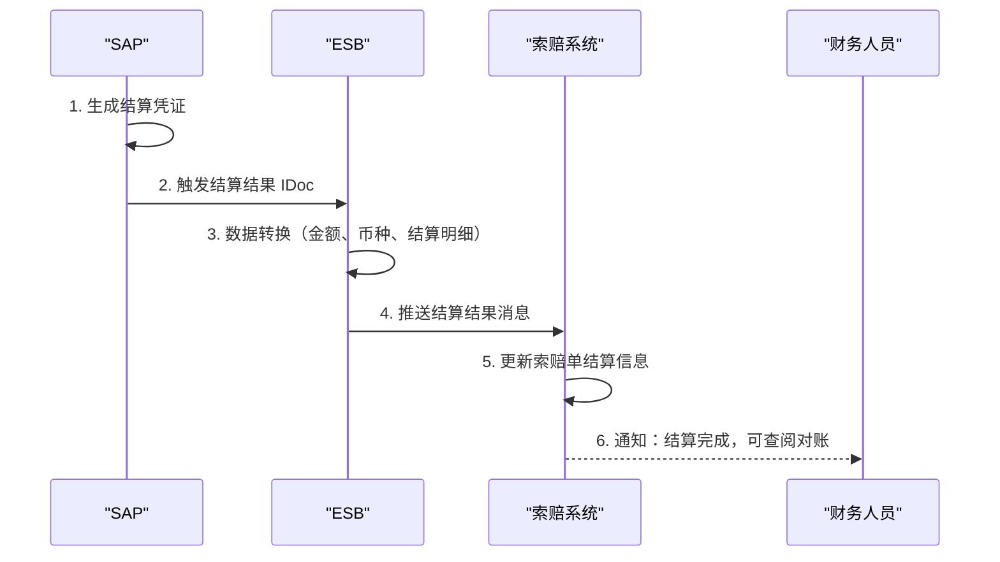
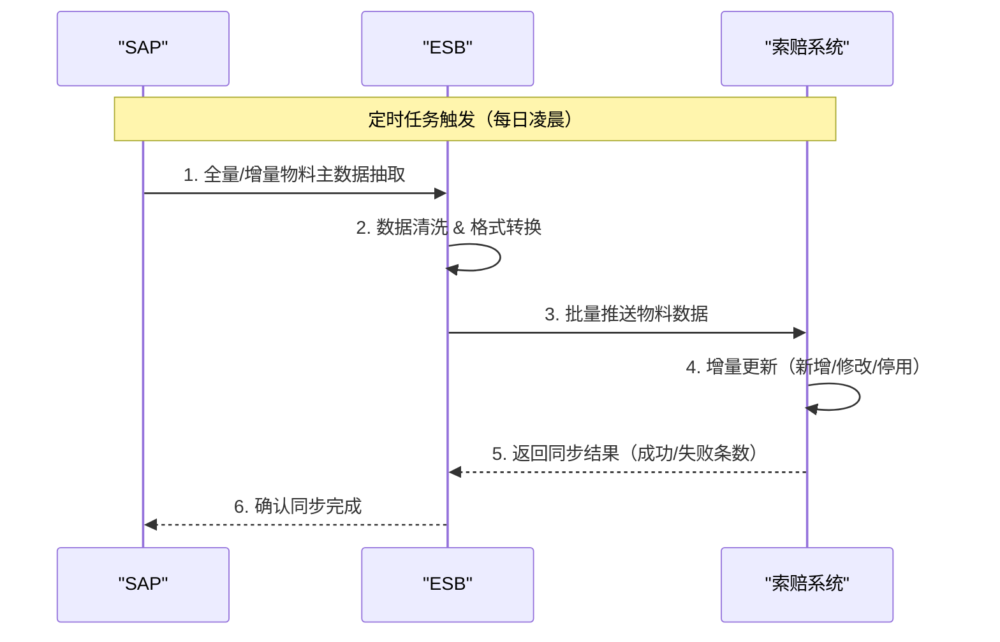
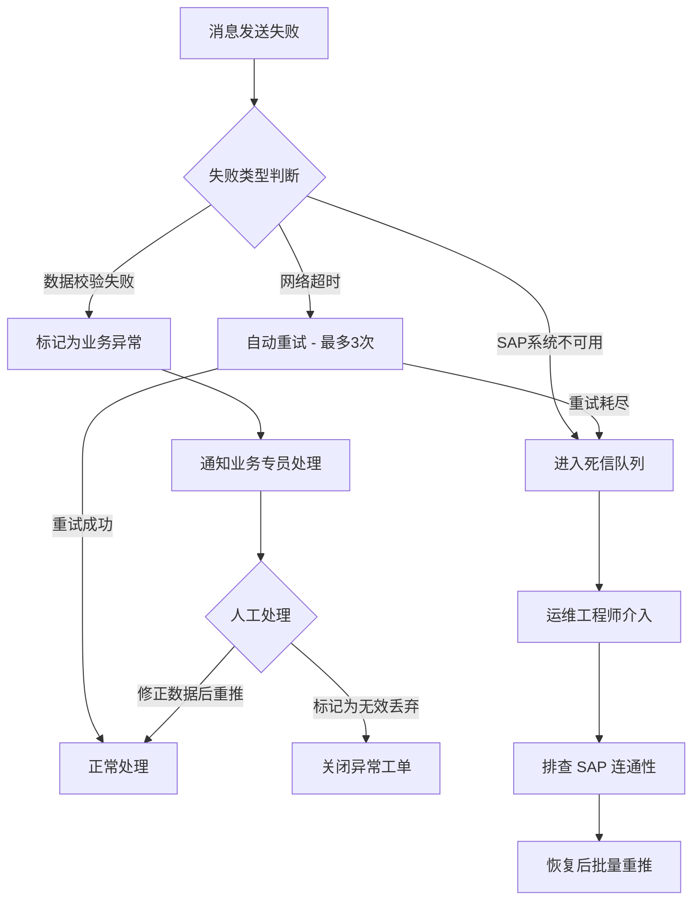
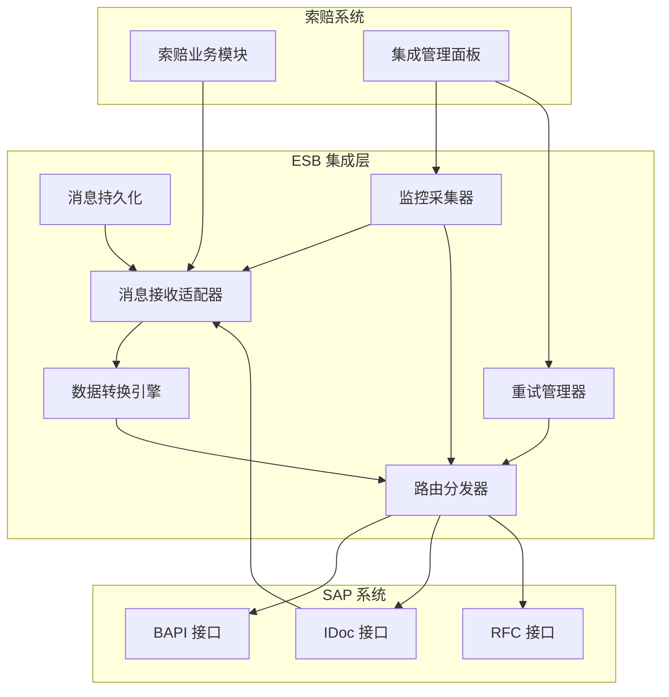

# 海外备件索赔集成（ESB → SAP）产品需求文档

**版本**: v1.0  
**日期**: 2026-06-29  
**作者**: 产品经理  

---

## 修订历史

| 版本 | 日期 | 修改人 | 修改说明 |
|------|------|--------|----------|
| v1.0 | 2026-06-29 | 产品经理 | 初始版本 |

---

## 1. 文档概述

### 1.1 背景说明

当前海外售后服务中，备件索赔流程依赖人工操作：海外服务站提交索赔申请后，业务人员需手动将索赔数据录入 SAP 系统，存在以下核心痛点：

- **效率低下**：人工二次录入 SAP 耗时耗力，单据处理周期长（平均 3-5 个工作日）
- **数据不一致**：人工转录易出错，索赔系统与 SAP 数据经常不一致，对账困难
- **状态追踪滞后**：SAP 中的审批结果、财务结算信息无法实时回传至索赔系统，海外服务站无法及时了解索赔进展
- **主数据维护成本高**：备件物料主数据（料号、价格、供应商等）在 SAP 和索赔系统之间缺乏自动同步机制

为解决上述问题，需要通过 ESB（企业服务总线）实现海外备件索赔模块与 SAP 系统的全面集成，打通数据链路，实现索赔全流程自动化。

### 1.2 项目目标

| 目标 | 量化指标 |
|------|----------|
| 消除人工二次录入 | 索赔单据自动推送 SAP，人工干预率 < 5% |
| 缩短索赔处理周期 | 单据处理周期从 3-5 天缩短至 1 天以内 |
| 数据一致性 | 索赔系统与 SAP 数据一致率 ≥ 99.5% |
| 状态实时回传 | SAP 审批/结算结果 15 分钟内同步至索赔系统 |
| 主数据自动同步 | 物料主数据每日自动同步，差异率 < 0.1% |

### 1.3 需求范围

**包含（In Scope）：**
- 索赔单据从索赔系统经 ESB 推送至 SAP（创建/修改/取消）
- SAP 审批状态、处理结果回传至索赔系统
- SAP 财务结算结果回传至索赔系统
- SAP 物料主数据同步至索赔系统
- ESB 集成层的异常处理、重试、日志监控
- 集成链路的监控告警面板

**不包含（Out of Scope）：**
- 索赔系统内部的业务审批流程改造
- SAP 内部的审批逻辑变更
- 海外服务站的移动端 UI 改造
- 与 WMS（仓储管理系统）的集成

### 1.4 技术栈

| 层级 | 技术选型 |
|------|----------|
| 索赔系统 | 待定（由实施团队决定） |
| ESB 中间件 | 企业服务总线（支持 SOAP/REST/IDoc 协议适配） |
| SAP 系统 | SAP ECC 6.0 或 S/4HANA |
| 通信协议 | SOAP Web Services / BAPI / IDoc（按接口类型选用） |
| 数据格式 | XML（SOAP/IDoc）/ JSON（REST） |
| 监控 | ESB 自带监控 + 统一告警平台 |

---

## 2. 用户角色与术语

### 2.1 用户角色

| 角色 | 描述 | 主要操作 |
|------|------|----------|
| 海外服务站人员 | 提交索赔申请的一线人员 | 创建索赔单、查看索赔状态 |
| 索赔业务专员 | 审核和处理索赔单据的业务人员 | 审批索赔、处理异常单据、手动触发重推 |
| 财务人员 | 处理索赔结算的财务人员 | 查看结算回传结果、对账 |
| ESB 运维工程师 | 维护 ESB 集成链路的运维人员 | 监控消息状态、处理异常消息、管理重试策略 |
| SAP 管理员 | 管理 SAP 接口配置的系统管理员 | 配置接口参数、监控 IDoc 状态、管理主数据 |

### 2.2 业务术语表

| 术语 | 英文 | 说明 |
|------|------|------|
| 备件索赔 | Spare Parts Claim | 海外服务站因产品质量问题向总部发起的备件更换/补偿请求 |
| ESB | Enterprise Service Bus | 企业服务总线，作为中间件连接索赔系统与 SAP |
| BAPI | Business Application Programming Interface | SAP 业务应用编程接口 |
| IDoc | Intermediate Document | SAP 中间文档，用于系统间异步数据交换 |
| ALE | Application Link Enabling | SAP 应用链接使能，支持分布式系统间通信 |
| 物料主数据 | Material Master Data | SAP 中备件物料的基础信息（料号、名称、价格、供应商等） |
| 索赔单据 | Claim Document | 包含索赔明细（备件、工时、运费等）的业务单据 |
| 索赔单号 | Claim Number | 索赔系统生成的唯一标识，映射到 SAP 中的凭证号 |
| 结算凭证 | Settlement Document | SAP 中生成的财务结算记录 |
| 重推 | Retry / Repush | 对发送失败的消息进行重新发送 |

---

## 3. 核心业务流程

### 3.1 索赔单据提交（索赔系统 → ESB → SAP）



### 3.2 索赔状态回传（SAP → ESB → 索赔系统）



### 3.3 财务结算回传（SAP → ESB → 索赔系统）



### 3.4 物料主数据同步（SAP → ESB → 索赔系统）



### 3.5 异常处理流程



---

## 4. 功能需求详情

### 4.1 功能清单

| 编号 | 功能模块 | 功能点 | 描述 | 优先级 | 验收标准 |
|------|----------|--------|------|--------|----------|
| F-01 | 索赔单据推送 | 创建索赔单 | 索赔系统创建单据后自动推送 ESB，ESB 转换后调 SAP 创建凭证 | P0 | SAP 成功创建凭证，回写凭证号 |
| F-02 | 索赔单据推送 | 修改索赔单 | 索赔单修改后同步更新 SAP 对应凭证 | P0 | SAP 凭证同步更新，字段一致 |
| F-03 | 索赔单据推送 | 取消索赔单 | 索赔单取消后同步 SAP 标记凭证作废 | P0 | SAP 凭证状态变为已取消 |
| F-04 | 索赔单据推送 | 批量重推 | 对发送失败的单据支持批量重新推送 | P1 | 失败单据可一键重推并返回结果 |
| F-05 | 状态回传 | 审批状态同步 | SAP 审批结果（通过/拒绝/补充）回传索赔系统 | P0 | 状态变更后 15 分钟内同步完成 |
| F-06 | 状态回传 | 状态变更通知 | 状态变更后触发通知（邮件/站内信） | P1 | 通知及时送达，内容准确 |
| F-07 | 结算回传 | 结算结果同步 | SAP 结算凭证信息回传索赔系统 | P0 | 金额、币种、明细准确同步 |
| F-08 | 结算回传 | 对账报表 | 基于回传数据生成索赔对账报表 | P2 | 报表数据与 SAP 一致 |
| F-09 | 主数据同步 | 物料全量同步 | 首次部署或紧急情况下全量同步物料数据 | P1 | 全量同步完成率 ≥ 99.9% |
| F-10 | 主数据同步 | 物料增量同步 | 定时增量同步物料变更数据 | P0 | 每日增量同步，延迟 < 24h |
| F-11 | 主数据同步 | 物料查询 | 索赔系统可查询已同步的物料信息 | P1 | 查询响应 < 500ms |
| F-12 | 监控告警 | 消息状态监控 | ESB 消息发送/接收状态可视化 | P0 | 实时监控，异常 5 分钟内告警 |
| F-13 | 监控告警 | 异常消息管理 | 异常消息查看、重试、手动关闭 | P0 | 异常消息可追溯、可操作 |
| F-14 | 监控告警 | 链路健康检查 | 定期检测 ESB-SAP 链路连通性 | P1 | 链路中断自动告警 |
| F-15 | 日志审计 | 操作日志 | 所有集成操作记录完整日志 | P1 | 日志可查可导出 |

---

## 5. 详细功能设计

### 5.1 接口设计

#### 5.1.1 接口总览

| 编号 | 接口名称 | 方向 | 协议 | 触发方式 | 频率 |
|------|----------|------|------|----------|------|
| API-01 | 创建索赔单 | 索赔系统 → ESB → SAP | SOAP/BAPI | 事件驱动（实时） | 按需 |
| API-02 | 修改索赔单 | 索赔系统 → ESB → SAP | SOAP/BAPI | 事件驱动（实时） | 按需 |
| API-03 | 取消索赔单 | 索赔系统 → ESB → SAP | SOAP/BAPI | 事件驱动（实时） | 按需 |
| API-04 | 索赔状态回传 | SAP → ESB → 索赔系统 | IDoc/REST | 事件驱动 | 按需 |
| API-05 | 结算结果回传 | SAP → ESB → 索赔系统 | IDoc/REST | 事件驱动 | 按需 |
| API-06 | 物料主数据同步 | SAP → ESB → 索赔系统 | IDoc/REST | 定时任务 | 每日 1 次 |
| API-07 | 批量重推 | 索赔系统 → ESB | REST | 手动触发 | 按需 |
| API-08 | 消息状态查询 | 索赔系统 → ESB | REST | 页面查询 | 按需 |
| API-09 | 链路健康检查 | ESB ↔ SAP | SOAP Ping | 定时任务 | 每 5 分钟 |

---

#### 5.1.2 API-01：创建索赔单

**概述：** 索赔系统创建索赔单后，通过 ESB 将数据转换并推送 SAP 创建对应凭证。

**请求（索赔系统 → ESB）：**

- **Method**: POST
- **URL**: `/api/esb/claims/create`
- **Headers**:

| Header | 值 | 说明 |
|--------|-----|------|
| Content-Type | application/json | 数据格式 |
| X-Request-Id | UUID | 请求唯一标识，用于幂等和追踪 |
| X-Source-System | CLAIM_SYS | 来源系统标识 |

**Request Body：**

```json
{
  "requestId": "uuid-xxxx-xxxx",
  "claimNumber": "CLM-2026-000001",
  "claimType": "SPARE_PART",
  "claimDate": "2026-06-29",
  "serviceStation": {
    "stationCode": "OV-SH-001",
    "stationName": "上海海外服务站",
    "country": "CN",
    "region": "APAC"
  },
  "equipment": {
    "equipmentNumber": "EQ-100001",
    "serialNumber": "SN-2025-ABCDEF",
    "model": "MODEL-X100",
    "installationDate": "2025-01-15"
  },
  "claimItems": [
    {
      "lineNumber": 10,
      "materialNumber": "MAT-00001",
      "materialDescription": "液压泵总成",
      "quantity": 2,
      "unitPrice": 1500.00,
      "currency": "USD",
      "totalAmount": 3000.00,
      "defectCode": "DEF-003",
      "damageCode": "DMG-001",
      "causeCode": "CAUSE-002"
    },
    {
      "lineNumber": 20,
      "materialNumber": "MAT-00002",
      "materialDescription": "密封垫片套件",
      "quantity": 5,
      "unitPrice": 120.00,
      "currency": "USD",
      "totalAmount": 600.00,
      "defectCode": "DEF-001",
      "damageCode": "DMG-002",
      "causeCode": "CAUSE-001"
    }
  ],
  "laborCost": {
    "hours": 4.5,
    "ratePerHour": 80.00,
    "currency": "USD",
    "totalLaborCost": 360.00
  },
  "shippingCost": {
    "amount": 250.00,
    "currency": "USD"
  },
  "totalClaimAmount": 4210.00,
  "totalCurrency": "USD",
  "description": "液压系统故障，需更换液压泵及密封件",
  "attachments": [
    {
      "fileName": "fault_photo_01.jpg",
      "fileType": "image/jpeg",
      "fileUrl": "https://claim.example.com/attachments/xxx.jpg"
    }
  ]
}
```

**Response Body（ESB → 索赔系统，成功）：**

```json
{
  "code": 200,
  "message": "success",
  "data": {
    "requestId": "uuid-xxxx-xxxx",
    "claimNumber": "CLM-2026-000001",
    "sapDocumentNumber": "SAP-DOC-20260001",
    "sapCompanyCode": "1000",
    "status": "ACCEPTED",
    "timestamp": "2026-06-29T10:30:00Z"
  }
}
```

**Response Body（失败）：**

```json
{
  "code": 500,
  "message": "SAP 创建凭证失败",
  "data": {
    "requestId": "uuid-xxxx-xxxx",
    "claimNumber": "CLM-2026-000001",
    "sapErrorCode": "BAPI_E_001",
    "sapErrorMessage": "Material number MAT-00001 not valid for company code 1000",
    "retryable": false,
    "timestamp": "2026-06-29T10:30:05Z"
  }
}
```

**字段映射（ESB 转换规则）：**

| 索赔系统字段 | SAP 字段 | 转换规则 |
|-------------|----------|----------|
| claimNumber | XBLNR（凭证参考号） | 直接映射 |
| claimDate | BLDAT（凭证日期） | yyyy-MM-dd → SAP Date |
| serviceStation.stationCode | KUNNR（客户编号） | 通过映射表转换 |
| equipment.equipmentNumber | EQUNR（设备号） | 直接映射 |
| claimItems[].materialNumber | MATNR（物料号） | 补前导零至 18 位 |
| claimItems[].quantity | MENGE（数量） | 直接映射 |
| claimItems[].unitPrice | PREIS（单价） | 直接映射 |
| claimItems[].currency | WAERS（币种） | ISO 4217 → SAP 内部币种码 |
| claimItems[].defectCode | FEHLER（缺陷码） | 通过码表映射 |
| totalClaimAmount | WRBTR（凭证金额） | 汇总计算 |
| laborCost.totalLaborCost | 附加成本行项目 | 转为虚拟料号行项目 |
| shippingCost.amount | 附加成本行项目 | 转为虚拟料号行项目 |

**校验规则：**

| 校验项 | 规则 | 失败处理 |
|--------|------|----------|
| claimNumber | 必填，最大 30 位，唯一 | 拒绝请求，返回 400 |
| claimDate | 必填，格式 yyyy-MM-dd | 拒绝请求，返回 400 |
| materialNumber | 必填，需在 SAP 物料主数据中存在 | 拒绝请求，返回 400 |
| quantity | 必填，正整数 | 拒绝请求，返回 400 |
| unitPrice | 必填，≥ 0 | 拒绝请求，返回 400 |
| currency | 必填，ISO 4217 标准币种码 | 拒绝请求，返回 400 |
| totalClaimAmount | 必填，= Σ(行项目金额) + laborCost + shippingCost | 拒绝请求，返回 400 |

**幂等性设计：**
- 基于 `requestId` 实现幂等，相同 requestId 不重复创建
- ESB 缓存 requestId → sapDocumentNumber 映射（TTL 24h）

---

#### 5.1.3 API-02：修改索赔单

**请求（索赔系统 → ESB）：**

- **Method**: PUT
- **URL**: `/api/esb/claims/update`

**Request Body：**

```json
{
  "requestId": "uuid-yyyy-yyyy",
  "claimNumber": "CLM-2026-000001",
  "sapDocumentNumber": "SAP-DOC-20260001",
  "changeReason": "数量调整",
  "claimItems": [
    {
      "lineNumber": 10,
      "materialNumber": "MAT-00001",
      "quantity": 3,
      "unitPrice": 1500.00,
      "totalAmount": 4500.00,
      "changeType": "MODIFY"
    },
    {
      "lineNumber": 30,
      "materialNumber": "MAT-00003",
      "quantity": 1,
      "unitPrice": 800.00,
      "totalAmount": 800.00,
      "changeType": "ADD"
    }
  ],
  "totalClaimAmount": 5910.00,
  "totalCurrency": "USD"
}
```

**Response Body（成功）：**

```json
{
  "code": 200,
  "message": "success",
  "data": {
    "requestId": "uuid-yyyy-yyyy",
    "claimNumber": "CLM-2026-000001",
    "sapDocumentNumber": "SAP-DOC-20260001",
    "status": "UPDATED",
    "timestamp": "2026-06-29T11:00:00Z"
  }
}
```

---

#### 5.1.4 API-03：取消索赔单

**请求（索赔系统 → ESB）：**

- **Method**: POST
- **URL**: `/api/esb/claims/cancel`

**Request Body：**

```json
{
  "requestId": "uuid-zzzz-zzzz",
  "claimNumber": "CLM-2026-000001",
  "sapDocumentNumber": "SAP-DOC-20260001",
  "cancelReason": "客户撤回索赔申请"
}
```

**Response Body（成功）：**

```json
{
  "code": 200,
  "message": "success",
  "data": {
    "claimNumber": "CLM-2026-000001",
    "sapDocumentNumber": "SAP-DOC-20260001",
    "status": "CANCELLED",
    "timestamp": "2026-06-29T11:30:00Z"
  }
}
```

---

#### 5.1.5 API-04：索赔状态回传

**请求（SAP → ESB → 索赔系统）：**

- **Method**: POST
- **URL**: `/api/claims/status-callback`
- **触发方式**: SAP 审批完成后通过 IDoc / 事件触发

**Request Body：**

```json
{
  "sapDocumentNumber": "SAP-DOC-20260001",
  "claimNumber": "CLM-2026-000001",
  "status": "APPROVED",
  "statusDescription": "审批通过",
  "approvedBy": "APPROVER-001",
  "approvedDate": "2026-06-29",
  "approvedAmount": 4210.00,
  "currency": "USD",
  "remarks": "",
  "rejectReason": null,
  "timestamp": "2026-06-29T14:00:00Z"
}
```

**状态码映射：**

| SAP 状态码 | 索赔系统状态 | 说明 |
|-----------|-------------|------|
| A | PENDING | 待审批 |
| B | APPROVED | 审批通过 |
| C | REJECTED | 审批拒绝 |
| D | SUPPLEMENT | 需补充材料 |
| E | SETTLED | 已结算 |
| F | CANCELLED | 已取消 |

---

#### 5.1.6 API-05：结算结果回传

**Request Body：**

```json
{
  "sapDocumentNumber": "SAP-DOC-20260001",
  "claimNumber": "CLM-2026-000001",
  "settlementDocument": "STL-2026-000001",
  "settlementDate": "2026-07-15",
  "settlementItems": [
    {
      "lineNumber": 10,
      "materialNumber": "MAT-00001",
      "approvedQuantity": 2,
      "approvedUnitPrice": 1500.00,
      "settlementAmount": 3000.00
    },
    {
      "lineNumber": 20,
      "materialNumber": "MAT-00002",
      "approvedQuantity": 5,
      "approvedUnitPrice": 120.00,
      "settlementAmount": 600.00
    }
  ],
  "totalSettlementAmount": 4210.00,
  "currency": "USD",
  "paymentTerms": "NET30",
  "timestamp": "2026-07-15T09:00:00Z"
}
```

---

#### 5.1.7 API-06：物料主数据同步

**请求（SAP → ESB → 索赔系统）：**

- **Method**: POST
- **URL**: `/api/materials/sync`
- **触发方式**: 定时任务（每日凌晨 02:00）

**Request Body（增量同步）：**

```json
{
  "syncType": "INCREMENTAL",
  "extractDate": "2026-06-29",
  "materials": [
    {
      "materialNumber": "MAT-00001",
      "description": "液压泵总成",
      "descriptionEn": "Hydraulic Pump Assembly",
      "materialGroup": "HYD-01",
      "baseUnit": "PC",
      "grossWeight": 25.5,
      "weightUnit": "KG",
      "standardPrice": 1500.00,
      "priceCurrency": "USD",
      "supplierCode": "SUP-001",
      "supplierName": "XX液压科技有限公司",
      "status": "ACTIVE",
      "validFrom": "2026-01-01",
      "validTo": "9999-12-31",
      "changeFlag": "U"
    }
  ],
  "totalCount": 150,
  "changeFlags": {
    "created": 5,
    "updated": 120,
    "deactivated": 25
  }
}
```

**Response Body：**

```json
{
  "code": 200,
  "message": "success",
  "data": {
    "received": 150,
    "success": 148,
    "failed": 2,
    "failedDetails": [
      {
        "materialNumber": "MAT-INVALID",
        "reason": "物料号格式不合法"
      }
    ]
  }
}
```

---

#### 5.1.8 API-07：批量重推

- **Method**: POST
- **URL**: `/api/esb/claims/retry`

**Request Body：**

```json
{
  "claimNumbers": [
    "CLM-2026-000001",
    "CLM-2026-000003",
    "CLM-2026-000005"
  ],
  "retryType": "ALL"
}
```

**Response Body：**

```json
{
  "code": 200,
  "message": "success",
  "data": {
    "total": 3,
    "success": 2,
    "failed": 1,
    "details": [
      { "claimNumber": "CLM-2026-000001", "status": "SUCCESS", "sapDoc": "SAP-DOC-20260001" },
      { "claimNumber": "CLM-2026-000003", "status": "SUCCESS", "sapDoc": "SAP-DOC-20260003" },
      { "claimNumber": "CLM-2026-000005", "status": "FAILED", "error": "物料号不存在" }
    ]
  }
}
```

---

#### 5.1.9 API-08：消息状态查询

- **Method**: GET
- **URL**: `/api/esb/messages?status=FAILED&startDate=2026-06-01&endDate=2026-06-29&page=1&size=20`

**Response Body：**

```json
{
  "code": 200,
  "message": "success",
  "data": {
    "total": 45,
    "page": 1,
    "size": 20,
    "items": [
      {
        "messageId": "MSG-000001",
        "claimNumber": "CLM-2026-000005",
        "interfaceName": "CREATE_CLAIM",
        "direction": "OUTBOUND",
        "status": "FAILED",
        "errorCode": "MAT_NOT_FOUND",
        "errorMessage": "物料号不存在",
        "retryCount": 3,
        "maxRetry": 3,
        "createdTime": "2026-06-28T10:00:00Z",
        "lastRetryTime": "2026-06-28T10:15:00Z"
      }
    ]
  }
}
```

---

### 5.2 数据库设计

#### 5.2.1 集成消息记录表（claim_integration_message）

| 字段名 | 类型 | 主键 | 索引 | 必填 | 说明 |
|--------|------|------|------|------|------|
| id | bigint | PK | - | Y | 自增主键 |
| message_id | varchar(64) | - | UK | Y | 消息唯一标识（UUID） |
| request_id | varchar(64) | - | IDX | Y | 请求幂等标识 |
| claim_number | varchar(30) | - | IDX | Y | 索赔单号 |
| sap_document_number | varchar(30) | - | IDX | N | SAP 凭证号 |
| interface_name | varchar(50) | - | IDX | Y | 接口标识（CREATE_CLAIM / UPDATE_CLAIM 等） |
| direction | varchar(10) | - | - | Y | 方向：OUTBOUND / INBOUND |
| status | varchar(20) | - | IDX | Y | 状态：PENDING / SUCCESS / FAILED / RETRYING / DEAD |
| request_payload | text | - | - | Y | 请求报文（JSON/XML） |
| response_payload | text | - | - | N | 响应报文 |
| error_code | varchar(50) | - | IDX | N | 错误码 |
| error_message | varchar(500) | - | - | N | 错误信息 |
| retry_count | int | - | - | Y | 已重试次数，默认 0 |
| max_retry | int | - | - | Y | 最大重试次数，默认 3 |
| next_retry_time | datetime | - | IDX | N | 下次重试时间 |
| source_system | varchar(20) | - | - | Y | 来源系统标识 |
| created_at | datetime | - | IDX | Y | 创建时间 |
| updated_at | datetime | - | - | Y | 更新时间 |
| created_by | varchar(50) | - | - | Y | 创建人 |

**索引设计：**
- UK: `message_id`（唯一约束）
- IDX: `claim_number`（按索赔单号查询）
- IDX: `sap_document_number`（按 SAP 凭证号查询）
- IDX: `interface_name + status`（按接口类型和状态查询）
- IDX: `created_at`（按时间范围查询）
- IDX: `next_retry_time`（重试调度查询）

#### 5.2.2 索赔单-SAP映射表（claim_sap_mapping）

| 字段名 | 类型 | 主键 | 索引 | 必填 | 说明 |
|--------|------|------|------|------|------|
| id | bigint | PK | - | Y | 自增主键 |
| claim_number | varchar(30) | - | UK | Y | 索赔单号 |
| sap_document_number | varchar(30) | - | UK | Y | SAP 凭证号 |
| sap_company_code | varchar(10) | - | - | Y | SAP 公司代码 |
| claim_status | varchar(20) | - | IDX | Y | 索赔状态 |
| sap_status | varchar(10) | - | - | Y | SAP 侧状态码 |
| approved_amount | decimal(18,2) | - | - | N | 批准金额 |
| settlement_document | varchar(30) | - | IDX | N | 结算凭证号 |
| settlement_amount | decimal(18,2) | - | - | N | 结算金额 |
| settlement_date | date | - | - | N | 结算日期 |
| currency | varchar(3) | - | - | Y | 币种 |
| created_at | datetime | - | - | Y | 创建时间 |
| updated_at | datetime | - | - | Y | 更新时间 |

#### 5.2.3 物料主数据同步日志表（material_sync_log）

| 字段名 | 类型 | 主键 | 索引 | 必填 | 说明 |
|--------|------|------|------|------|------|
| id | bigint | PK | - | Y | 自增主键 |
| sync_type | varchar(20) | - | - | Y | 同步类型：FULL / INCREMENTAL |
| sync_date | date | - | IDX | Y | 同步日期 |
| total_count | int | - | - | Y | 本次同步总数 |
| success_count | int | - | - | Y | 成功数 |
| failed_count | int | - | - | Y | 失败数 |
| created_count | int | - | - | Y | 新增数 |
| updated_count | int | - | - | Y | 更新数 |
| deactivated_count | int | - | - | Y | 停用数 |
| status | varchar(20) | - | - | Y | 同步状态：SUCCESS / PARTIAL / FAILED |
| error_detail | text | - | - | N | 错误明细（JSON） |
| started_at | datetime | - | - | Y | 开始时间 |
| finished_at | datetime | - | - | N | 结束时间 |

---

### 5.3 ESB 集成层设计

#### 5.3.1 架构概览



#### 5.3.2 重试策略

| 重试次数 | 间隔 | 累计等待 | 说明 |
|----------|------|----------|------|
| 第 1 次 | 1 分钟 | 1 分钟 | 立即重试 |
| 第 2 次 | 5 分钟 | 6 分钟 | 短暂延迟 |
| 第 3 次 | 30 分钟 | 36 分钟 | 较长延迟 |
| 重试耗尽 | - | - | 进入死信队列，通知运维处理 |

#### 5.3.3 数据转换规则

| 转换项 | 源格式 | 目标格式 | 规则说明 |
|--------|--------|----------|----------|
| 物料号 | MAT-00001 | 000000000000MAT00001 | SAP 18 位物料号（补前导零） |
| 日期 | 2026-06-29 | 20260629 | SAP 日期格式（YYYYMMDD） |
| 金额 | 4210.00 (USD) | 4210.00 | SAP 金额保持精度，币种单独字段 |
| 客户编号 | OV-SH-001 | 0001000001 | 通过映射表转为 SAP 10 位客户号 |
| 缺陷码 | DEF-003 | 0003 | 通过码表映射为 SAP 内部码 |
| 索赔类型 | SPARE_PART | ZSP | 自定义映射（需配置 SAP 索赔类型） |

---

### 5.4 监控告警设计

#### 5.4.1 监控面板功能

| 面板模块 | 展示内容 | 刷新频率 |
|----------|----------|----------|
| 消息概览 | 今日消息总量、成功/失败/重试中数量 | 实时 |
| 接口状态 | 各接口成功率、平均耗时、最近错误 | 5 分钟 |
| 链路健康 | ESB-SAP 连通性状态、最近心跳时间 | 5 分钟 |
| 异常队列 | 失败消息列表、错误原因、重试次数 | 实时 |
| 同步统计 | 物料同步成功率、最近同步时间 | 每日 |

#### 5.4.2 告警规则

| 告警项 | 触发条件 | 告警级别 | 通知方式 |
|--------|----------|----------|----------|
| 消息发送失败率 | 5 分钟内失败率 > 10% | P1 - 紧急 | 邮件 + 短信 |
| 链路中断 | 连续 2 次心跳失败 | P0 - 严重 | 邮件 + 短信 + 电话 |
| 重试队列积压 | 死信队列消息 > 50 条 | P2 - 警告 | 邮件 |
| 物料同步失败 | 全量同步失败 | P1 - 紧急 | 邮件 |
| 消息延迟 | 消息处理耗时 > 30s | P2 - 警告 | 邮件 |

---

## 6. 任务拆分

### 6.1 开发任务

| 编号 | 任务 | 负责角色 | 工时估算 | 优先级 | 依赖项 |
|------|------|----------|----------|--------|--------|
| T-01 | SAP 接口调研 & 联调环境搭建 | 后端 + SAP 管理员 | 40h | P0 | - |
| T-02 | ESB 适配层开发：创建索赔单接口 | 后端 | 24h | P0 | T-01 |
| T-03 | ESB 适配层开发：修改/取消索赔单接口 | 后端 | 16h | P0 | T-02 |
| T-04 | ESB 数据转换引擎：字段映射 & 码表配置 | 后端 | 16h | P0 | T-01 |
| T-05 | ESB 重试机制 & 死信队列 | 后端 | 16h | P0 | T-02 |
| T-06 | SAP 侧 IDoc 配置：状态回传 | SAP 管理员 | 24h | P0 | T-01 |
| T-07 | SAP 侧 IDoc 配置：结算结果回传 | SAP 管理员 | 16h | P0 | T-06 |
| T-08 | SAP 侧物料主数据抽取接口 | SAP 管理员 | 16h | P0 | T-01 |
| T-09 | 索赔系统回调接口开发（状态/结算接收） | 后端 | 16h | P0 | - |
| T-10 | 集成消息记录表 & 映射表建表 | DBA + 后端 | 8h | P0 | - |
| T-11 | 索赔系统 - 集成管理面板前端开发 | 前端 | 32h | P1 | T-10 |
| T-12 | 监控告警面板开发 | 前端 + 后端 | 24h | P1 | T-10, T-05 |
| T-13 | 批量重推功能开发 | 后端 + 前端 | 12h | P1 | T-05, T-11 |
| T-14 | 对账报表开发 | 后端 + 前端 | 16h | P2 | T-09 |

### 6.2 测试任务

| 编号 | 任务 | 负责角色 | 工时估算 | 依赖项 |
|------|------|----------|----------|--------|
| T-15 | 单元测试（ESB 适配层 + 转换引擎） | 后端 | 16h | T-02 ~ T-05 |
| T-16 | 集成测试（索赔系统 ↔ ESB ↔ SAP 全链路） | 测试 | 32h | T-02 ~ T-09 |
| T-17 | 异常场景测试（网络中断、数据错误、重试） | 测试 | 16h | T-16 |
| T-18 | 性能测试（并发推送、批量同步） | 测试 | 12h | T-16 |
| T-19 | UAT 验收测试 | 业务 + 测试 | 16h | T-17, T-18 |

### 6.3 工时汇总

| 角色 | 总工时 | 说明 |
|------|--------|------|
| 后端开发 | ~160h | ESB 适配层、回调接口、重试机制、报表 |
| 前端开发 | ~72h | 管理面板、监控面板、报表页面 |
| SAP 管理员 | ~80h | 接口配置、IDoc 配置、联调 |
| DBA | ~8h | 建表、索引优化 |
| 测试 | ~76h | 集成测试、异常测试、性能测试、UAT |
| **合计** | **~396h** | 约 10 人周 |

---

## 7. 非功能性需求

### 7.1 性能要求

| 指标 | 要求 |
|------|------|
| 单笔消息处理耗时 | P95 < 5s（含 ESB 转换 + SAP 调用） |
| 批量物料同步 | 10,000 条/小时 |
| ESB 消息吞吐 | ≥ 100 TPS（峰值） |
| 监控面板刷新 | < 3s |

### 7.2 可用性要求

| 指标 | 要求 |
|------|------|
| ESB 集成层可用性 | ≥ 99.9%（全年宕机 < 8.76h） |
| 消息不丢失 | 所有消息必须持久化后再发送 |
| 故障恢复 | RTO < 30 分钟，RPO = 0 |

### 7.3 安全要求

| 要求 | 说明 |
|------|------|
| 传输加密 | ESB ↔ SAP 之间使用 TLS 1.2+ |
| 接口认证 | 基于 Token / 证书的双向认证 |
| 报文签名 | 关键业务报文（创建/修改/取消）添加数字签名 |
| 审计日志 | 所有接口调用记录完整审计日志，保留 180 天 |
| 敏感字段脱敏 | 金额、客户信息等字段在日志中脱敏 |
| 访问控制 | 集成管理面板基于角色权限控制 |

### 7.4 可扩展性

| 要求 | 说明 |
|------|------|
| 接口扩展 | 新增接口类型时仅需增加 ESB 路由配置和转换规则 |
| 码表可配 | 字段映射码表支持在线配置，无需发版 |
| 多公司代码 | 支持多个 SAP 公司代码的索赔单据路由 |
| 水平扩展 | ESB 适配层支持水平扩展以应对业务增长 |

---

## 8. 风险与应对

| 风险项 | 概率 | 影响 | 应对措施 |
|--------|------|------|----------|
| SAP 接口规范不明确 | 中 | 高 | 提前安排 SAP 管理员进行接口调研，输出接口规格说明书 |
| 物料号映射差异大 | 高 | 中 | 建立完整的映射码表，提供在线维护工具 |
| ESB-SAP 网络不稳定 | 中 | 高 | 配置完善的重试机制和死信队列，设置链路监控告警 |
| SAP 系统升级影响接口 | 低 | 高 | 接口设计遵循 SAP 标准 BAPI，降低升级影响 |
| 业务高峰期消息积压 | 中 | 中 | ESB 支持水平扩展，配置消息优先级和限流策略 |

---

## 9. 上线计划

| 阶段 | 时间 | 内容 |
|------|------|------|
| 第一阶段 | 第 1-2 周 | SAP 接口调研、联调环境搭建、接口规格确认 |
| 第二阶段 | 第 3-5 周 | ESB 适配层开发（创建/修改/取消 + 状态回传） |
| 第三阶段 | 第 6-7 周 | 结算回传 + 物料主数据同步开发 |
| 第四阶段 | 第 8 周 | 前端管理面板 + 监控面板开发 |
| 第五阶段 | 第 9-10 周 | 集成测试 + 异常测试 + 性能测试 |
| 第六阶段 | 第 11 周 | UAT 验收测试 + Bug 修复 |
| 第七阶段 | 第 12 周 | 灰度上线（选取 2-3 个服务站试点） |
| 第八阶段 | 第 13 周 | 全量上线 + 运维交接 |

---

## 10. 验收标准

| 验收项 | 标准 |
|--------|------|
| 索赔单创建 | 索赔系统创建单据后，SAP 成功生成对应凭证，回写凭证号 |
| 索赔单修改 | 修改内容实时同步 SAP，双方数据一致 |
| 索赔单取消 | SAP 凭证标记为已取消 |
| 审批状态回传 | SAP 审批完成后 15 分钟内索赔系统状态更新 |
| 结算结果回传 | 结算金额、明细准确同步，可生成对账报表 |
| 物料主数据同步 | 每日增量同步，延迟 < 24h，一致率 ≥ 99.9% |
| 异常处理 | 失败消息自动重试 3 次，重试耗尽进入死信队列可手动重推 |
| 监控告警 | 异常 5 分钟内触发告警，面板实时展示消息状态 |
| 性能 | 单笔处理 P95 < 5s，吞吐 ≥ 100 TPS |
